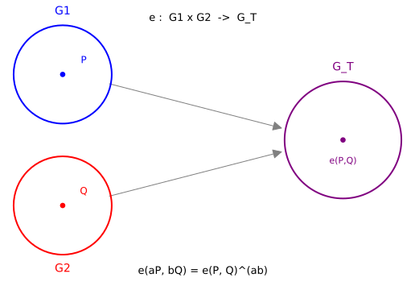

# Bilinear Pairings: Multiplying Inside Hidden Exponents

*Chapter 11 — Layer 6: The Bedrock · the primitive beneath KZG and the Groth16 verifier*
*Target depth: rigorous · stratum: Elliptic curves & pairings (the prerequisite peak)*

*Figure — the map `e: G₁ × G₂ → G_T`. A point `P` in the blue source group `G₁` and a point `Q` in the red source group `G₂` are fed to the pairing, producing a single element `e(P,Q)` in the purple target group `G_T`. Scaling the inputs raises the target element to the power `a·b`: `e(aP, bQ) = e(P, Q)^{ab}`.*

> **Animation:** [`animations/bilinear_pairings.mp4`](animations/bilinear_pairings.mp4) — the three groups appear; `P` and `Q` are paired into `e(P,Q)`; then the inputs are scaled to `aP`, `bQ` (here `a=2`, `b=4`) and the target jumps to `e(P,Q)^{a·b} = e(P,Q)^8`, with the concrete parameters `GF(23)`, `r=3`, `k=2` shown beneath the bilinearity identity.

---

> ### Math you'll need
>
> - **An elliptic-curve group of points** is the set of solutions `(x, y)` to a curve equation like `y² = x³ − x`, which you can *add* like vectors; this turns the points into a group, and **scalar multiplication** `aP = P + P + … + P` (`a` copies) plays the role of "exponentiation".
> - **The two source groups `G₁` and `G₂`** are two order-`r` subgroups of such a curve — think of them as two independent "lines" of points, one feeding each slot of the pairing.
> - **The target group `G_T`** is where the pairing's *answer* lives. It is **not** a curve point: it is a number in a field, and you combine its elements by *multiplying* — so "scaling" there means raising to a power.
> - **The pairing map `e`** eats one point from `G₁` and one from `G₂` and returns a single element `e(P, Q)` of `G_T`. Read `e(P, Q)` as "the pairing of `P` and `Q`".
> - **Bilinear** means linear in each input separately, which forces the one identity everything rests on: `e(aP, bQ) = e(P, Q)^{ab}` — scaling the inputs by `a` and `b` multiplies the hidden exponent by `a·b`.
> - Write `F_q` for a finite field with `q` elements and `F_{q^k}` for its degree-`k` extension; the **embedding degree** `k` is the size of extension you must climb to before `G_T` appears.
>
> *Carried in from Ch 9:* the polynomial-commitment interface (commit / open / verify) that pairings are about to *build*. *From Ch 2:* the sealed-envelope picture, and *from Ch 3:* Powers-of-Tau — pairings are the mechanism that turns `g^{p(τ)}` into a checkable commitment. The slogan you've met but not yet earned: a pairing is *"a bilinear multiplication you can do on hidden exponents."* Here we earn it.

---

## Pre-rigorous — one multiplication on hidden exponents

For two chapters you have used a polynomial commitment as a **sealed envelope**: the prover hides a value `g^x`, and later the verifier wants to be sure of some *relation* among the hidden values — say, that one hidden number is the **product** of two others — without ever opening the envelopes.

Ordinary group exponentiation can **add** hidden exponents: `g^x · g^y = g^{x+y}`. It cannot **multiply** them. A bilinear pairing is the tool that buys you exactly one multiplication on hidden exponents.

The figure shows the shape of it. There are three groups — a blue `G₁`, a red `G₂`, and a purple target `G_T` — and a map `e` that eats one point from each source group and lands a single element in the target. Drop `P` into `G₁` and `Q` into `G₂`; the pairing produces `e(P,Q)` over in `G_T`.

Now the move that matters. **Scale the inputs** — take `aP` instead of `P`, `bQ` instead of `Q` — and the target element is raised to the power `a·b`. On a tiny curve over `GF(23)` with `a = 2` and `b = 4`, the pairing of the scaled points equals the original pairing value raised to the **8th** power. You did not learn `a` or `b`; you only confirmed that the hidden multiplication `a·b` happened, sitting safely up in an exponent.

*(No formal definition yet — first the picture of "multiply inside the exponent", then the notation.)*

## Rigorous — earn the identity

A **bilinear pairing** is a map `e: G₁ × G₂ → G_T` between three groups of the same prime order `r`, with two properties. The first is **bilinearity**: `e` is linear in each argument *separately*, so `e(aP, Q) = e(P, Q)^a` and `e(P, bQ) = e(P, Q)^b`. The second is **non-degeneracy**: if `P, Q` are generators then `e(P, Q) ≠ 1`, so the map is not trivial.

Apply linearity in each slot in turn and the central identity falls out in one line:

> **`e(aP, bQ) = e(P, bQ)^a = (e(P, Q)^b)^a = e(P, Q)^{ab}`.**

That single line is the whole identity. The product `a·b` lands in the exponent because `e` is linear in *each* argument: pull `a` out of the first slot, pull `b` out of the second, and the two scalars compose multiplicatively.

Now locate the groups concretely so none of this is mystical. Take the supersingular curve `E: y² = x³ − x` over `GF(23)`. It has an `r = 3` torsion subgroup, and its **embedding degree is `k = 2`** — `3` divides `23² − 1 = 528` but not `23 − 1 = 22`, so the full 3-torsion `E[3] ≅ ℤ/3 × ℤ/3` and the target group only appear once you pass to the extension field `GF(23²)`. There, `G₁` and `G₂` are independent order-3 lines inside `E[3]`, and `G_T` is the group `μ₃` of **cube roots of unity** inside `GF(23²)*` — the standard codomain of the **Weil pairing**, which pairs two `r`-torsion points into the `r`-th roots of unity.

Take `P = (2, 12)` and `Q = (14t+9, 22t+22)`. The Weil pairing gives `e(P, Q) = 19t + 15`, an element of `GF(23²)*` of multiplicative **order 3** — *not* a curve point. With `a = 2` and `b = 4`, scaling the inputs gives `e(aP, bQ) = 4t + 7`, and raising the original value to the eighth power gives `e(P, Q)^{a·b} = (19t+15)^8 = 4t + 7`. They are equal: bilinearity holds exactly, with no error term.

That equality also clears away three tempting wrong pictures at once. The output is *not* a curve point — it lives in the multiplicative group of a field extension, `μ_r ≤ F_{q^k}^*`, which is exactly why the operation on it is *exponentiation* rather than scalar multiplication. The scalars *multiply* in the exponent, giving `a·b = 8`, not `a + b = 6`; that is what "linear in *each* argument" forces. And you learned `a·b` only as an exponent, never `a` or `b` themselves — recovering `a` from `aP` is the discrete-logarithm problem, which is assumed infeasible, so a pairing checks a multiplicative relation but never inverts one.

One number deserves a careful word so it does not read as a contradiction. The honest exponent is `a·b = 8`, and that is what bilinearity literally produces. Because `e(P,Q)` has order 3, raising it to the 8th power is the same as raising it to the 2nd — `8 mod 3 = 2` — so `e^8 = e^2`, both equal to `4t + 7`. The reduction `8 mod 3 = 2` is a *consequence* of the group order, not a rival answer: `(19t+15)^8` and `(19t+15)^2` name the same element.

## Post-rigorous — both halves at once

Now the slogan and the symbols are one statement. "Multiply inside the hidden exponent" *is* the identity `e(aP, bQ) = e(P, Q)^{ab}`: the picture of two scaled source points feeding one boosted target element is precisely linearity applied in each slot. The two source groups `G₁, G₂` are the two arguments the map is linear in; the purple target `G_T = μ_r` is why the result is an exponent and not a point; non-degeneracy (`e(P, Q) ≠ 1`) is what makes the comparison mean anything. You could have invented this yourself: wanting one multiplication on hidden exponents, you would demand a map linear in each argument and add non-degeneracy so the check is meaningful — and the product `a·b` in the exponent would be *forced*, not chosen.

Two boundaries keep this honest. First, a pairing **checks** a multiplicative relation; it never **inverts** one. It does not recover exponents, so it does not break discrete log — and if it did, the whole tower above it would fall. Second, this only works on **pairing-friendly curves**: the embedding degree `k` must be *small* so `G_T` lives in a small extension `F_{q^k}` where `e` is actually computable. **BN254** and **BLS12-381** are engineered for small `k`; **secp256k1**'s `k` is astronomically large, so it has no usable pairing. That single design constraint — together with the **Extended Tower Number Field Sieve**, the attack that sizes these curves — is why Layer 6 names BLS12-381 specifically.

---

## Check yourself

**Recall.** What is a bilinear pairing? Name its domain and codomain, and state the one identity that makes it "bilinear".
> *Answer:* A non-degenerate map `e: G₁ × G₂ → G_T` between three prime-order groups, linear in each argument, with `e(aP, bQ) = e(P, Q)^{ab}`. `G₁, G₂` are `r`-torsion subgroups of an elliptic curve over `F_q`; `G_T` is the group of `r`-th roots of unity `μ_r` in `F_{q^k}^*` — not the curve.
> *If you miss this →* revisit the target group `G_T = μ_r` in `F_{q^k}^*`, where the pairing value lives.

**Apply.** On `E: y² = x³ − x` over `GF(23)` with `r = 3` and `k = 2`, `e(P, Q) = 19t+15` (order 3). For `a = 2`, `b = 4`, what is `e(aP, bQ)`, and why is it `e(P, Q)^8` rather than `e(P, Q)^6`?
> *Answer:* `e(aP, bQ) = e(P, Q)^{a·b} = e(P, Q)^8 = (19t+15)^8 = 4t+7`. The **product** `a·b = 8`, not the **sum** `a+b = 6`, because the pairing is linear in each argument separately. (Since `e(P,Q)` has order 3, `e^8 = e^2 = 4t+7` — the same element, the exponent just reduced mod 3.)
> *If you miss this →* revisit cyclic groups (generators, order, and the additive vs multiplicative way of writing the operation).

**Transfer.** A KZG / Groth16 verifier wants to confirm a multiplicative relation among hidden exponents without learning them. Why is a bilinear pairing the right tool, and what does it crucially NOT let the verifier do?
> *Answer:* Encode secrets as exponents (`g^x = xP`); the pairing turns exponent multiplication into a check on visible elements, `e(aP, bQ) = e(P, Q)^{ab}` — the single pairing-product equation behind KZG's opening check and the Groth16 verifier. It does **not** recover `a` or `b` (that is the discrete-log problem, assumed hard) — it checks a relation, never inverts one. Only small-`k` pairing-friendly curves (BN254/BLS12-381) make it computable.
> *If you miss this →* revisit the discrete-logarithm problem (given `P` and `aP`, recovering `a` is infeasible).

**Rediscover.** You want an operation that "multiplies hidden exponents" so a verifier can check a product relation without learning the exponents. What three properties must it have, and how do they force `e(aP, bQ) = e(P, Q)^{ab}`?
> *Answer:* (1) `e: G₁ × G₂ → G_T` — one element from each source group into a third; (2) linear in the first argument, `e(aP, Q) = e(P, Q)^a`; (3) linear in the second, `e(P, bQ) = e(P, Q)^b`. Apply (2) then (3): `e(aP, bQ) = (e(P, Q)^b)^a = e(P, Q)^{ab}` — the product is forced. Add non-degeneracy (`e(P, Q) ≠ 1`) and you have the bilinear pairing.
> *If you miss this →* revisit elliptic-curve groups (the points form an abelian group; `aP = P + … + P`).

---

*Next: with one multiplication on hidden exponents in hand, a verifier can collapse a polynomial-commitment opening to a single pairing-product equation — the KZG check — and bundle a whole circuit's correctness into the three group elements the Groth16 verifier weighs against one pairing. That is the move the rest of Layer 6 is built to exploit.*
