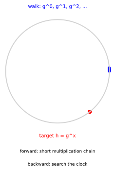

# Discrete Logarithm Problem: The Easy Clock With One Hard Direction

*Chapter 11 - cryptographic primitives and hardness assumptions*
*Target depth: rigorous - stratum: group theory and number-theoretic hardness*

*Figure - In the order-1019 subgroup of `F_2039*`, multiplying by `g = 9` walks around a finite clock. The public target is `h = 211`; the hidden clock position is `x = 873`.*

> **Animation:** [`animations/discrete-log.mp4`](animations/discrete-log.mp4) - the forward walk `g^0, g^1, g^2, ...` is easy to generate, while the target `h` does not label its own exponent.

---

> ### Math you'll need
> A **group** is a set with one operation, an identity element, and inverses, so you can combine elements without leaving the set. A **finite field** `F_p` is arithmetic modulo a prime `p`: after `p - 1`, the next value wraps to `0`. A **subgroup** is a smaller self-contained group living inside a larger one — a subset that is still closed under the same operation, with its own identity and inverses. A **cyclic group** is generated by one element `g`, meaning the powers `g^0, g^1, g^2, ...` reach every group element; `|G|` means the number of elements in the group, also called its **order**. In `g^x`, the exponent `x` counts repeated group multiplication, and the **discrete logarithm** `log_g(h)` is the exponent that lands on `h`. Watch for two moduli: the group elements like `g` and `h` are numbers reduced modulo the prime `p`, while the exponents and the order are counted modulo the smaller number `q = |G|`.

---

## Pre-rigorous - the unlabeled clock

The picture is a clock whose tick marks have been scrambled into group elements. You can start at `1`, multiply by `g`, and keep walking: `g^0`, `g^1`, `g^2`, and onward. That direction is mechanical. Given the step count, the landing point is cheap to compute.

The reverse question feels different. Someone hands you the landing point `h` and asks where it sits on the walk. On a tiny clock you can try every tick. On a cryptographic clock, that search is meant to be out of reach. The discrete logarithm problem is exactly that reverse question: find the hidden step count.

You could have invented the assumption by asking for a public action that hides its private counter. Walking forward should be easy enough for honest users; labeling the landing point should be hard enough that an attacker cannot recover the counter.

## Rigorous - what the attacker receives

Let `G` be a prime-order cyclic group, let `g` be a generator of `G`, and let `h` be another element of `G`. The discrete logarithm problem asks for the exponent `x` in the range `0 <= x < |G|` such that

> `h = g^x`.

The exponent is unique in that range because `g` generates a group of prime order. In the worked example, `G` is a subgroup — a smaller self-contained group living inside a larger one — of the nonzero elements of `F_2039`. Here is where the size comes from. The prime `p = 2039` has 2038 nonzero values to multiply together, but we do not work in all of them. Since `2039 = 2 * 1019 + 1`, those 2038 elements split into a block of 1019 and its mirror, and we live inside the prime-size block of 1019. Prime order is the point: it forces the discrete logarithm `x` to be unique, with no smaller cycle to confuse the search.

Two moduli are now in play, and keeping them apart is what makes the numbers add up. The group elements `g` and `h` are ordinary numbers reduced modulo the prime `p = 2039`, so they can be as large as 2038; every multiplication of group elements wraps mod `2039`. The exponent `x` and the order, by contrast, are counted modulo `q = 1019`: stepping the exponent past `1019` returns to where it started. So a group element such as `h = 211` lives mod `2039`, while the count of steps lives mod `1019`. The generator is `g = 9`, the secret exponent is `x = 873`, and the public value is `h = 211`.

Forward exponentiation uses repeated squaring and multiplying. For this concrete exponent, the square-and-multiply chain uses 14 group multiplications. That number is not a security claim; it is the cost of the honest direction in the toy instance. A naive reverse search checks `g^0`, `g^1`, and so on until it reaches `h`. Here it finds the answer after 874 candidates, and the worst case in this toy group is 1019 candidates.

That comparison kills the tempting inverse-operation story. Division reverses multiplication in an ordinary field because the inverse is efficiently computable. Discrete log is not that kind of inverse. It is a named search problem, and the security statement is conditional: for large, carefully chosen groups, no efficient classical algorithm is known for recovering `x` from `g` and `h`. The toy numbers are deliberately breakable so the mechanism is visible.

## Post-rigorous - a public map with a private coordinate

Now the clock picture and the formal definition say the same thing. The public map sends `x` to `g^x`; the hidden coordinate is `log_g(h)`. Nothing mystical hides inside the notation. The asymmetry is computational: one direction has a short multiplication chain, and the other appears to require a search with no shortcut in the groups chosen for deployment.

This is why discrete-log language keeps returning when commitments, signatures, and key exchange appear. A protocol can publish group elements that are easy to verify against algebraic equations, while the exponents behind those elements remain private. The distinction to keep sharp is between a proved identity and a hardness bet. The equation `h = g^x` is exact; the claim that `x` is infeasible to recover is an assumption about algorithms and parameters.

## Check yourself

**Recall.** In a cyclic group generated by g, what is the discrete logarithm of h to base g?
> *Answer:* It is the exponent x such that h = g^x, with x taken modulo the group order.
> *If you miss this ->* revisit cyclic groups and generator notation.

**Apply.** In the toy group, what public value comes from g = 9 and x = 873?
> *Answer:* The public value is h = 211.
> *If you miss this ->* revisit modular exponentiation in a finite group.

**Transfer.** Why can a protocol publish h = g^x while still treating x as secret?
> *Answer:* Computing h from x is fast, while recovering x from g and h is assumed infeasible in a large well-chosen group.
> *If you miss this ->* revisit one-way functions and hardness assumptions.

**Rediscover.** You can multiply by g quickly but cannot label every position on a huge group clock. What hard problem would you base a public key on?
> *Answer:* Publish the landing point h = g^x and keep x secret; the hard task is finding the clock position x from g and h.
> *If you miss this ->* revisit cyclic group order and brute-force search.

---

*Next: the security-model chapter sharpens the difference between an algebraic identity and an assumption about every efficient attacker.*
