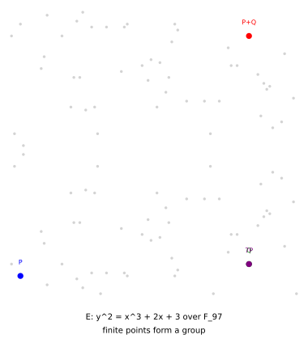

# Elliptic-Curve Groups: Turning Points Into Algebra

*Chapter 11 - curves, pairings, fields, and primitive choices*
*Target depth: rigorous - stratum: elliptic curves and pairings*

*Figure - The curve `y^2 = x^3 + 2x + 3` over `F_97` has `99` finite points; adding the point at infinity gives group order `100`.*

> **Animation:** [`animations/elliptic-curves.mp4`](animations/elliptic-curves.mp4) - a chord-and-reflect picture explains the group law over the reals, then the finite-field point set shows the cryptographic object.

---

> ### Math you'll need
> A **finite field** `F_p` is arithmetic modulo a prime `p`, so division means multiplying by a modular inverse when that inverse exists. An **elliptic curve** in this setting is the set of solutions to an equation such as `y^2 = x^3 + ax + b`, together with one extra identity element called the **point at infinity** and written `O`. A **group** is a set with an associative operation, an identity, and inverses. **Scalar multiplication** `aP` means add the point `P` to itself `a` times; it does not mean multiply the coordinates by `a`.

---

## Pre-rigorous - the chord is a memory aid

Over the real numbers, the addition rule has a picture. Draw a line through two points on the curve. It meets the curve a third time. Reflect that third point across the horizontal axis, and the reflected point is the sum.

Cryptography does not use the smooth real curve. It uses a finite set of points over a field like `F_p`, where the arithmetic wraps modulo `p`. The chord picture still teaches the rule, but the actual operation is a formula in modular arithmetic.

You could have invented the group law by asking for a way to make curve points combine while staying on the curve. The line gives the missing constraint: it turns geometry into algebra.

## Rigorous - point addition over a finite field

The worked curve is

> `E: y^2 = x^3 + 2x + 3 over F_97`.

The group consists of every finite solution `(x, y)` plus the identity `O`. This example has `99` finite points and group order `100` after adding `O`.

For two different points `P = (x_P, y_P)` and `Q = (x_Q, y_Q)`, the slope is

> `lambda = (y_Q - y_P) / (x_Q - x_P) mod p`.

Then

> `x_{P+Q} = lambda^2 - x_P - x_Q mod p`,
> `y_{P+Q} = lambda(x_P - x_{P+Q}) - y_P mod p`.

Here `P = (3, 6)` and `Q = (80, 10)`. The slope is `58`, and the sum is `P+Q = (80, 87)`. The scalar multiple `7P` is `(80, 10)`, and a separate repeated-addition computation gives the same point.

This kills the coordinate-wise instinct. Adding `P` and `Q` is not `(3+80, 6+10)` modulo `97`. The operation is the chord-derived formula above, with a special doubling formula when `P = Q` and the identity `O` handling vertical lines.

## Post-rigorous - why curves become primitives

Elliptic curves give cryptography a compact group with a lopsided cost. Going forward — computing `aP` from a known scalar `a` and point `P` — is fast. Going backward — recovering the secret `a` when you are shown only `P` and `aP` — is believed to be infeasible for well-chosen curves. That gap between an easy direction and a hard one is the **elliptic-curve discrete logarithm problem**, and it is what lets the curve keep a secret. The real drawing helps the rule feel inevitable; the finite-field group is what signatures, commitments, and pairing systems actually manipulate.

Once points form a group, the rest of the primitive stack has something to stand on. Later chapters build on this base — among them **pairings**, a special multiplication that takes two curve points and returns a number, letting one hidden value be checked against another without revealing either. For now the payoff is simpler: a group where one direction is cheap and the other is hard is exactly the raw material a cryptographic secret needs. The next chapter asks what it really means to trust algebra performed inside these groups.

## Check yourself

**Recall.** What is the identity element in an elliptic-curve group?
> *Answer:* It is the point at infinity, usually written O.
> *If you miss this ->* revisit group identity and inverses.

**Apply.** What point is P+Q in the toy curve over F_97?
> *Answer:* P+Q = (80, 87).
> *If you miss this ->* revisit elliptic-curve addition formula.

**Transfer.** Why is the smooth real drawing not the object used in cryptography?
> *Answer:* Cryptography uses the finite set of solutions over F_p; the drawing explains the chord rule, while the actual group operation is modular arithmetic.
> *If you miss this ->* revisit finite fields and modular reduction.

**Rediscover.** If you need a public operation that repeats a group step many times, what curve operation would you use?
> *Answer:* Use scalar multiplication: repeatedly add P to itself to get aP, which is fast forward and can underlie a discrete-log assumption on suitable curves.
> *If you miss this ->* revisit group addition and scalar multiples.

---

*Next: the security-model chapter asks how far algebraic reasoning inside these groups can be trusted once adversaries choose the group elements.*
