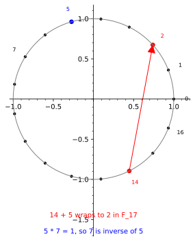

# Finite fields: Arithmetic on a Closed Clock

*Chapter 7 - from arithmetization intuition to the engine's arithmetic floor*
*Target depth: rigorous - stratum: Algebra I*

*Figure - In `F_17`, the expression `14 + 5` lands at `2` because arithmetic wraps after 16. Multiplication also wraps: `5 * 7 = 1`, so `7` is the multiplicative inverse of `5`.*

> **Animation:** [`animations/finite-fields.mp4`](animations/finite-fields.mp4) - the clock walk for `14 + 5` and the inverse fact `5 * 7 = 1`.

---

> ### Math you'll need
> Modular arithmetic means keeping only the remainder after division by a fixed number. In `F_17`, the field with 17 elements, the allowed values are `0, 1, ..., 16`, and two numbers that differ by a multiple of 17 count as the same value. A field is a number system where addition, subtraction, multiplication, and division by any nonzero element stay inside the system; division is done by multiplying by an inverse, a value that brings you back to `1`.

---

## Pre-rigorous - the clock that never breaks

Start with a 17-hour clock. If the hand points at `14` and you move it forward `5` ticks, it does not fall off the dial. It lands on `2`. That is not an approximation to 19; it is the exact answer once the clock is the world.

The more surprising move is multiplication. On this clock, `5 * 7` also lands on `1`. That makes `7` the number that undoes multiplication by `5`. The field has kept the familiar arithmetic feeling - add, subtract, multiply, divide - while forcing every answer to stay on a finite dial.

You could have invented the need for this. A verifier wants to choose a random challenge from a set it can count, and the algebra still needs division so polynomials behave. A finite field gives both: a finite number of choices and a clean arithmetic system.

## Rigorous - what the word field buys

For a prime number `p`, `F_p` is the set of residues `0, 1, ..., p-1` with arithmetic done modulo `p` — every sum and product wrapped back into `0..p-1`, and `p` taken prime precisely so that division by any nonzero value works. The notation `F_p` means "the field with `p` elements," and `|F|` denotes that count of elements. In `F_17`, `14 + 5 = 19`, and `19` has remainder `2` after division by 17, so `14 + 5 = 2` in the field.

The key field requirement is division by every nonzero element. To divide by `a`, you multiply by a value `a^{-1}`, read "the inverse of `a`," such that `a * a^{-1} = 1`. In `F_17`, the inverse of `5` is `7` because `5 * 7 = 35`, and `35` leaves remainder `1` modulo 17.

Primality matters. Modulo 15, the nonzero values `3` and `5` multiply to `0`, so neither can have an inverse: if `3` had an inverse, multiplying `3 * 5 = 0` by it would say `5 = 0`. That contradiction is why a composite clock may be a ring but not a field. A prime clock has no such zero divisors, so every nonzero value can be undone.

Wrapping is not rounding. Equal residues are exactly equal, not approximately so, so nothing has been thrown away when `19` becomes `2`. Nor is division here the decimal division of school arithmetic; to divide is simply to multiply by the inverse that lands you back on `1`. And the word "finite" carries no demotion: a finite field is no less mathematical than the rationals. What its finiteness buys is a real denominator for every later probability — `|F|`, the count of elements in the field.

## Post-rigorous - the stage under the whole engine

Once the field is in place, polynomials become countable objects. A low-degree polynomial over `F_17` can be evaluated at exactly 17 possible inputs, and a random challenge can mean "choose each field element with probability `1/17`." That is the measure this chapter needs when it says a bad polynomial is caught except on a small fraction of points.

Finite fields are also the reason arithmetization can bind a computation without leaving algebra. The Sudoku constraints of Ch 6, the interpolation step that follows here, and the proof systems of Ch 10 all need multiplication and division to stay inside the same world. The clock is small in the picture, but the idea is large: make arithmetic finite without letting it become sloppy.

## Check yourself

**Recall.** What does it mean for `7` to be the inverse of `5` in `F_17`?
> *Answer:* It means `5 * 7 = 1` in the field. Since `35` leaves remainder `1` modulo 17, multiplying by `7` undoes multiplying by `5`.
> *If you miss this ->* revisit modular arithmetic and the meaning of an inverse.

**Apply.** Compute `14 + 5` and `6 * 8` in `F_17`.
> *Answer:* `14 + 5 = 19 = 2` modulo 17. Also `6 * 8 = 48 = 14` modulo 17.
> *If you miss this ->* practice reducing ordinary integer answers to their remainders.

**Transfer.** Why does this chapter prefer a finite field to the real numbers for random spot-checks?
> *Answer:* A finite field has a countable number of equally likely choices, so "bad points divided by all points" is a concrete probability such as `d/|F|`. The real numbers do not give that simple finite denominator.
> *If you miss this ->* revisit probability as counting equally likely outcomes.

**Rediscover.** You need an arithmetic system where every verifier challenge comes from a finite set, but polynomial division still works. What property would you demand?
> *Answer:* Demand a finite set closed under addition, subtraction, multiplication, and division by nonzero values. That demand is exactly the field property.
> *If you miss this ->* revisit why composite moduli can have zero divisors.

---

*Next, once a few field values are pinned down, Lagrange interpolation shows how a whole polynomial can be forced through them.*
