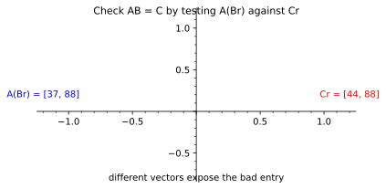

# Freivalds' Algorithm: A Matrix Product's Random Shadow

*Chapter 7 - the first concrete fingerprint*
*Target depth: rigorous - stratum: linear algebra*

*Figure - For the claimed product `C`, the random vector `r = [7,11]` gives `A(Br) = [37,88]` but `Cr = [44,88]`, so the claim `AB = C` is exposed as false.*

> **Animation:** [`animations/freivalds.mp4`](animations/freivalds.mp4) - the product claim is compressed through one vector, and the two resulting shadows disagree.

---

> ### Math you'll need
> A finite field is a number system with only finitely many values - here the integers 0 through 100 - in which you can add, subtract, multiply, and divide, with every result wrapped back into that range. A matrix-vector product turns a matrix into one vector of linear combinations. The error matrix is `E = C - AB`, the claimed product minus the true product. A random vector over that field means each coordinate is chosen independently and uniformly from it.

---

## Pre-rigorous - compare the shadow

Suppose someone hands you three huge matrices and claims `AB = C`. Recomputing `AB` is the expensive thing you were trying to avoid. Freivalds' trick is to cast one random shadow instead.

Choose a random vector `r`. If `AB = C`, then `A(Br)` and `Cr` must be the same vector, because both are just `(AB)r`. If the product is false, the two shadows usually separate. In the figure, the claimed matrix is off by one entry, and the sample vector turns that hidden mistake into the visible mismatch `[37,88]` versus `[44,88]`.

You could have invented the test from associativity. Matrix multiplication is expensive; matrix-vector multiplication is cheaper. So push the big equality through one random vector and compare the smaller results.

## Rigorous - the hidden linear equation

Let `A`, `B`, and `C` be `n by n` matrices over a finite field `F`. Freivalds' one-round test chooses `r` uniformly from `F^n`, the set of length-`n` vectors over the field, and accepts if

> `A(Br) = Cr`.

If `AB = C`, the test always accepts. That is completeness. If `AB != C`, define the nonzero error matrix `E = C - AB`. The test accepts exactly when `Er = 0`, because `Cr - A(Br) = (C - AB)r`.

Since `E` is nonzero, at least one row of `E` is a nonzero vector. The dot product of that row with `r` is a nonzero linear expression in the random coordinates of `r`. Once all but one coordinate are fixed, at most one value of the remaining coordinate can make the expression zero. Because that coordinate has `|F|` equally likely values, the chance is at most `1/|F|`.

For our example, `F = F_101`. The claimed `C` differs from the true `AB` in the first entry, and `r = [7,11]` catches it. A cheating product can pass one round, but with probability at most `1/101`; repeating independent rounds multiplies the risk down.

## Post-rigorous - the first fingerprint

Freivalds is this chapter's doorway because it makes the book's soundness pattern concrete before polynomials enter. A giant claim is compressed to a random small test. If the claim is true, every shadow agrees. If the claim is false, only a small set of shadows can hide it.

The same rhythm returns in Reed-Solomon and Schwartz-Zippel. The object changes from a matrix product to a polynomial identity, but the shape is the same: turn global disagreement into a random local check with a counted failure set.

## Check yourself

**Recall.** What equality does Freivalds test instead of recomputing `AB`?
> *Answer:* It chooses a random vector `r` and tests whether `A(Br) = Cr`.
> *If you miss this ->* revisit associativity: `(AB)r = A(Br)`.

**Apply.** In the figure, the two shadows are `[37,88]` and `[44,88]`. What does that prove?
> *Answer:* They are unequal, so `AB` cannot equal the claimed `C`.
> *If you miss this ->* revisit the implication from a true product to equal shadows.

**Transfer.** Why is the one-round failure probability at most `1/|F|` over a finite field?
> *Answer:* If the product is wrong, a nonzero row of the error matrix gives a nonzero linear equation in the random vector. After all but one coordinate are fixed, at most one field value can make that equation vanish.
> *If you miss this ->* revisit nonzero linear equations over a field.

**Rediscover.** You want to check a huge matrix product cheaply. What random object should you multiply by, and why?
> *Answer:* Multiply by a random vector `r` and compare `A(Br)` with `Cr`. A true product survives every vector; a false product usually has a different random shadow.
> *If you miss this ->* revisit matrix-vector multiplication as a compressed view of a matrix.

---

*Next, the same random-shadow instinct becomes polynomial fingerprinting, where one field point can stand in for a whole low-degree object.*
