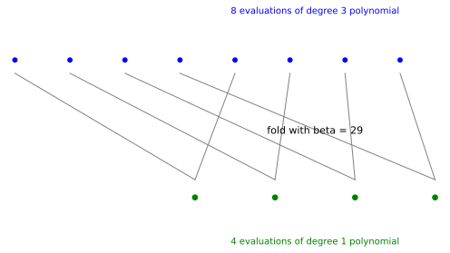

# FRI Low-Degree Testing: Folding a Polynomial Until It Has Nowhere to Hide

*Chapter 11 - cryptographic primitives and polynomial commitments*
*Target depth: rigorous - stratum: coding theory and hashing*

*Figure - One FRI round pairs evaluations on an order-8 domain and folds them with `beta = 29`, producing a word on 4 points.*

> **Animation:** [`animations/fri.mp4`](animations/fri.mp4) - the domain halves while the displayed degree drops from `3` to `1` in the worked example.

---

> ### Math you'll need
> A **finite field** `F_p` is arithmetic modulo a prime `p`, with values wrapping around after `p - 1`. A polynomial's **degree** is the largest exponent with a nonzero coefficient. A **Reed-Solomon codeword** is a list of values made by evaluating a low-degree polynomial on a chosen domain. A **low-degree test** does not ask whether two explicit formulas are equal; it asks whether an oracle-like list of values is close to some low-degree polynomial. An **oracle** here is a list of values we can ask about one entry at a time but cannot read in full.

---

## Pre-rigorous - make the lie survive compression

FRI begins with a long table of claimed polynomial values. Reading all of it would defeat the purpose, so the verifier forces the table through a narrowing corridor. Pair positions together, mix each pair with a fresh random number, and ask the prover to continue with the shorter table.

An honest low-degree polynomial survives this compression cleanly. A dishonest table can still try to follow along, but each fold gives it fewer places to hide and each random consistency check ties the shorter table back to the longer one.

You could have invented the move by asking how to test a shape without seeing every point: compress the shape in a way that preserves honest low degree, then sample the seams.

## Rigorous - one folding round

Work over `F_97`. The example polynomial is

> `f(X) = 7 + 11X + 5X^2 + 3X^3`,

so its actual degree is `3`. The evaluation domain has `8` points generated by an element `omega = 64` with `omega^8 = 1`; pairing `x` with `-x` gives both points the same square `y = x^2`.

Split the polynomial into even and odd powers:

> `f(X) = f_even(X^2) + X * f_odd(X^2)`.

For this polynomial, `f_even(Y) = 7 + 5Y` and `f_odd(Y) = 11 + 3Y`. With random challenge `beta = 29`, the folded polynomial is

> `g(Y) = f_even(Y) + beta * f_odd(Y)`.

The computed folded coefficients are `[35, 92]`, so the folded polynomial has actual degree `1` on the squared domain of size `4`. The degree bound has also dropped: degree below `4` becomes degree below `2`. Those are bounds, not promises that every example lands exactly at half the old actual degree.

The consistency check uses the two original values `f(x)` and `f(-x)` to reconstruct the even and odd parts at `y = x^2`, then verifies that the shorter table really contains `g(y)`. In this worked domain, all four pair checks pass.

## Post-rigorous - proximity, not a magic eraser

The fold is not a proof by itself. A malicious prover could write down any shorter table if no one checked it against the longer one. FRI's force comes from repeating this degree-reducing step and sampling consistency along the way, so a word that is far from every low-degree polynomial keeps having to maintain contradictory stories.

This is why FRI is a proximity test: it asks whether the committed word is close to the Reed-Solomon code of low-degree polynomials. Merkle trees then make those oracle queries cheap and binding, turning the fold into a transparent polynomial-commitment route.

## Check yourself

**Recall.** In one FRI fold, what happens to the evaluation domain?
> *Answer:* Pairs `x` and `-x` are combined, so the domain moves from size `n` to roughly `n/2`.
> *If you miss this ->* revisit evaluation domains and pairing `x` with `-x`.

**Apply.** What are the actual degrees before and after the toy fold with `beta = 29`?
> *Answer:* The starting polynomial has actual degree `3`; the folded polynomial has actual degree `1`.
> *If you miss this ->* revisit polynomial degree.

**Transfer.** Why does FRI need random consistency checks after folding?
> *Answer:* A dishonest word could claim a convenient fold; random checks tie folded values back to paired original values so inconsistency is likely to be exposed.
> *If you miss this ->* revisit low-degree testing and oracle queries.

**Rediscover.** Given `f(X) = f_even(X^2) + X * f_odd(X^2)`, how would you shrink the problem while keeping a random fingerprint of both parts?
> *Answer:* Choose a random `beta` and form `f_even(Y) + beta * f_odd(Y)` on the squared domain; then check sampled pairs for consistency.
> *If you miss this ->* revisit even/odd coefficient split.

---

*Next: hashes and transcript challenges turn these oracle queries into non-interactive arguments, where the security model has to say exactly what the hash is allowed to promise.*
