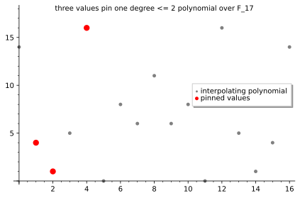

# Lagrange Interpolation: The Curve Forced by Its Pegs

*Chapter 7 - the bridge from tables to low-degree polynomials*
*Target depth: rigorous - stratum: Algebra I*

*Figure - The three red values `(1,4)`, `(2,1)`, and `(4,16)` pin a unique polynomial of degree at most 2 over `F_17`: `14 + 12x + 12x^2`.*

> **Animation:** [`animations/lagrange-interpolation.mp4`](animations/lagrange-interpolation.mp4) - three pegs appear first, then the low-degree curve is drawn through them.

---

> ### Math you'll need
> A polynomial's degree is the highest power of `x` that appears with a nonzero coefficient. Interpolation asks for a polynomial that hits prescribed values at prescribed inputs. In a finite field such as `F_17`, division means multiplying by an inverse, so expressions like `(x - x_j)/(x_i - x_j)` are legal as long as the pinned inputs `x_i` are distinct.

---

## Pre-rigorous - pegs before formulas

Imagine pushing three pegs into a board. If the thread is allowed to wiggle however it likes, those pegs do not determine much. But if the thread must be a straight line, two pegs are enough. If it must be a quadratic, three pegs are enough. The rule is not "points determine curves"; the rule is "points determine curves once the wiggle budget is fixed."

Over `F_17`, our three pegs are `(1,4)`, `(2,1)`, and `(4,16)`. The picture looks dotted because there are only 17 possible x-values, but the same forcing happens. There is exactly one polynomial of degree at most 2 that hits those three values.

You could have invented Lagrange interpolation by asking for three little switches. The first switch should be 1 at `x = 1` and 0 at the other two pegs; the second should be 1 at `x = 2` and 0 at the others; the third should do the same for `x = 4`. Then you scale the switches by the desired heights and add them.

## Rigorous - the switch basis

Suppose the pinned inputs are distinct field elements `x_1, ..., x_k`, and the desired values are `y_1, ..., y_k`. For each peg, define

> `L_i(x) = product over j != i of (x - x_j)/(x_i - x_j)`.

Here `L_i` is the ith Lagrange basis polynomial, a switch polynomial. At `x = x_i`, every numerator equals the matching denominator, so `L_i(x_i) = 1`. At any other pinned point `x_j`, one numerator becomes zero, so `L_i(x_j) = 0`.

The interpolating polynomial is

> `P(x) = y_1 L_1(x) + ... + y_k L_k(x)`.

At the first peg, all switches are off except `L_1`, so `P(x_1) = y_1`; the same argument holds at every peg. Its degree is at most `k - 1`, because each basis polynomial multiplies together `k - 1` linear factors.

Uniqueness is the quiet half of the theorem. If `P` and `Q` are two degree-at-most-`k-1` polynomials through the same `k` pegs, then `P - Q` has `k` roots. A nonzero polynomial of degree at most `k - 1` cannot have that many roots, so `P - Q` must be the zero polynomial. The two candidates were the same all along.

For the red pegs in the figure, the result is `P(x) = 14 + 12x + 12x^2` over `F_17`, and `P(7) = 6`. Those numbers are not a real-valued curve rounded into a field; every coefficient and evaluation is computed inside `F_17`.

## Post-rigorous - why the engine keeps using it

Lagrange interpolation is the first moment a table becomes a polynomial without losing its pinned values. A verifier can talk about a few table entries, while the proof system talks about one low-degree object that agrees with the table on a chosen domain. That object has a name worth holding onto: the low-degree extension, meaning the original table kept exactly as-is on its home inputs and then carried everywhere else by the single low-degree polynomial that runs through those inputs.

The bad intuition to leave behind is that interpolation itself proves honesty. It does not. All it guarantees is that if the degree promise is real, the table has one low-degree continuation. What makes lying about that continuation risky are two later checks. The first, named Schwartz-Zippel, catches a cheating prover because a wrong low-degree polynomial agrees with the honest one in only a handful of places, so a single randomly chosen test point almost always lands where the two disagree. The second, called low-degree testing, probes whether the object the prover handed over is even close to being a low-degree polynomial at all, rather than some high-degree impostor dressed up to pass at a few points. Downstream, this same switch-basis idea grows into selector polynomials, which turn a rule on for some rows of a computation and off for others, and vanishing polynomials, which mark exactly the inputs where a constraint must hold; bundled together, they pack a whole computation's worth of constraints into polynomial form, the shape that powers the proof systems of later chapters. So interpolation earns its keep not by proving anything on its own, but by being the lossless bridge that turns a table of values into the one low-degree object every later check is built to interrogate.

## Check yourself

**Recall.** What does the basis polynomial `L_i(x)` do at the pinned inputs?
> *Answer:* It equals `1` at its own pinned input `x_i` and `0` at every other pinned input.
> *If you miss this ->* revisit the product defining `L_i` and plug in each pinned x-value.

**Apply.** Three distinct x-values are pinned in a field. What is the largest degree needed to interpolate them uniquely?
> *Answer:* Degree at most `2`, because `k` points determine a unique polynomial of degree at most `k - 1` when the x-values are distinct.
> *If you miss this ->* revisit the uniqueness proof using roots of `P - Q`.

**Transfer.** Why is interpolation useful for turning a table into a proof-system object?
> *Answer:* It lets the table's values be represented by one low-degree polynomial that agrees on the table's domain, so later checks can reason about polynomial degree and random evaluations instead of raw rows.
> *If you miss this ->* revisit low-degree extension as "same values on the home domain, polynomial elsewhere."

**Rediscover.** Build a polynomial that is `1` at one peg and `0` at two others. What shape must it have?
> *Answer:* Multiply factors that vanish at the two other pegs, then divide by the value of that product at the chosen peg so the chosen value becomes `1`. That is the Lagrange switch.
> *If you miss this ->* revisit finite-field division as multiplying by inverses.

---

*Next, Reed-Solomon encoding uses the same low-degree promise to turn a short message into many consistent fingerprints.*
