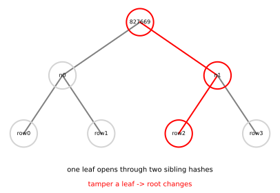

# Merkle Trees: A Short Root for a Long List

*Chapter 9 - IOPs, commitments, and the SNARK recipe*
*Target depth: rigorous - stratum: hashing and commitment to data*

*Figure - Four leaves are hashed upward into one root. To open leaf `2`, the prover sends that leaf and the sibling hash at each level on its path.*

> **Animation:** [`animations/merkle-trees.mp4`](animations/merkle-trees.mp4) - one branch lights up, then a tampered leaf propagates to a different root.

---

> ### Math you'll need
> A **hash function** maps data of any practical size to a short string called a digest. **Collision resistance** means it should be infeasible to find two different inputs with the same digest. A **commitment** lets someone fix data now and reveal selected parts later. In a binary tree, each internal node has two children; a **Merkle root** is the digest at the top, and an **authentication path** is the list of sibling digests needed to recompute that root from one leaf.

---

## Pre-rigorous - a receipt for one shelf

Imagine sealing a long shelf of records with a single receipt. Later, someone asks about one record, not the whole shelf. A Merkle tree is the trick that makes that possible: each pair of records is hashed into a parent, pairs of parents are hashed again, and the process continues until one short root remains.

The root is not a compressed copy of the data. It is a binding fingerprint of the whole arrangement. To open one position, the prover reveals the leaf and the few sibling hashes needed to climb back to the root. The verifier recomputes upward and checks whether the same root appears.

You could have invented the tree by refusing to choose between two bad options: sending the whole list, or trusting a bare leaf with no context.

## Rigorous - recomputing the root

The example uses SHA-256 and four leaves:

> `row0:alice:7`, `row1:bob:2`, `row2:carol:9`, `row3:dave:5`.

Each leaf is first hashed with a leaf tag, and each internal node hashes the ordered pair of child digests with a node tag. Those tags are simple domain separation: they keep a leaf hash from being confused with an internal-node hash.

The root begins with `827669c52893`. To open leaf index `2`, the proof supplies 2 sibling hashes. The side of each sibling matters, because hashing left-then-right is not the same as hashing right-then-left. Starting from the claimed leaf, the verifier hashes with the first sibling to rebuild the parent, then hashes with the next sibling to rebuild the root. In this worked tree, that recomputation matches the root, so the path verifies.

If the leaf changes to `row2:carol:10`, the root begins with `e25f1a2a7f66` instead. The statement is not that a different root is mathematically forced for all possible strings. A hash collision could keep the root fixed. The security claim is computational: finding such a collision should be infeasible for the chosen hash function.

## Post-rigorous - commitment by spot opening

A Merkle tree turns a long object into something a verifier can spot-check. The root binds the prover to one ordered list, and each path opens one position with logarithmic overhead. The verifier learns the opened leaf and the hashes on its path, not the other leaves.

That is the exact habit the proof engine needs: commit to a large oracle, then answer a few random queries with short openings. Hash-based proof systems use this pattern because it is transparent, simple to verify, and grounded in collision resistance rather than a trusted setup.

## Check yourself

**Recall.** What information is in a Merkle authentication path?
> *Answer:* It contains the sibling hash at each level, together with which side that sibling is on.
> *If you miss this ->* revisit binary hash tree structure.

**Apply.** For the toy tree, how many sibling hashes open leaf 2 to the root?
> *Answer:* The path has 2 sibling hashes.
> *If you miss this ->* revisit tree height and path length.

**Transfer.** Why does a changed leaf usually force a changed root?
> *Answer:* The changed leaf hash changes its parent, then that change propagates upward; keeping the same root would require a collision in the hash function.
> *If you miss this ->* revisit collision resistance.

**Rediscover.** You need to commit to a long list but later reveal only one position. What tree would you invent?
> *Answer:* Hash leaves, hash pairs upward to one root, then reveal the target leaf plus one sibling per level so the verifier recomputes the root.
> *If you miss this ->* revisit commit-and-open workflows.

---

*Next: this commit-and-open habit becomes one branch of the proof-system zoo, where a verifier checks a few positions of a much larger encoded object.*
