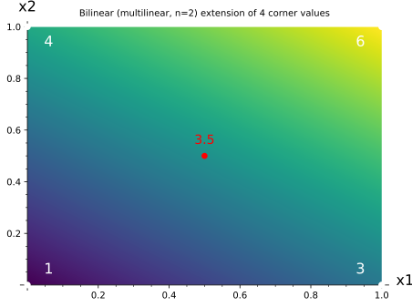

# Multilinear Extension: One Smooth Surface Through the Corners

*Chapter 7 — Fingerprints · the representation the whole engine is built on*
*Target depth: rigorous · stratum: Algebra II (multivariate & multilinear)*

*Figure — the four corner values `1, 4, 3, 6` on the unit square `{0,1}²`, extended to the unique smooth bilinear surface through them. It reproduces the corners, bends in the middle (a saddle), yet is straight along each axis; its center value is the average of the four corners, `3.5`.*

> **Animation:** [`animations/multilinear-extension.mp4`](animations/multilinear-extension.mp4) — four corner values are dropped on the square and the smooth surface fills in; each corner flashes to show the surface *agrees* with `f` there; a point then slides along an edge to show the value moves on a *straight line* (edge midpoint `= 2.0`), and the center lights up at `3.5`, the average of the four corners.

---

> ### Math you'll need
>
> - **The Boolean hypercube `{0,1}ⁿ`** is the set of all `2ⁿ` corners of an `n`-dimensional cube — every string of `n` zeros and ones — and we use it as the index set for a table of values, one number per corner.
> - **A field `F`** is a number system where you can add, subtract, multiply, and divide; here it is the integers `0,1,…,96` with arithmetic taken "mod 97" (wrap around after 96), and we write `|F|` for how many elements it has — here `|F| = 97`.
> - **Multilinear** describes a polynomial whose degree in each variable *separately* is at most `1`: no variable is ever squared, though distinct variables may still be multiplied together (so `x₁x₂x₃` is allowed). This is degree *per variable*, not total degree.
> - **The unique multilinear extension** of a table on the cube is the single multilinear polynomial whose values on the `2ⁿ` corners match the table exactly; "unique" because, as we will see, that many corner constraints pin a multilinear polynomial down completely.
>
> *Carried in from earlier in Ch 7:* finite-field arithmetic and univariate Lagrange interpolation — a table of values determines one low-degree polynomial through them; the multilinear extension is the multivariate echo of that. And from Ch 6, the idea that *polynomials encode the computation* and that a whole-table claim can be reduced to a claim about one random point. Schwartz–Zippel (just proved) is the tool that will later test multilinear-extension identities — here we build the object it tests.

---

## Pre-rigorous — fill in the surface

You have a function that only exists at corners. Think of a table with one number sitting on each corner of a cube: over the unit square `{0,1}²` that is four numbers — say `1`, `4`, `3`, `6` — perched at the four corners and *nothing in between*. You want a single smooth object that **passes through all four corner values** and fills in everything else, so you can probe it anywhere.

The figure shows the answer. Drop the four corner values, and there is one natural surface that flows through them: each corner is reproduced exactly, and as you move across the square the height glides smoothly. Look closer and two things stand out. First, the surface **agrees with the table on every corner** — that is the whole job. Second, it is **straight along each axis**: walk along one edge with the other coordinate held fixed and the height changes on a *straight line* (the midpoint of the bottom edge sits at `2`, exactly halfway between the corners `1` and `3`). The middle of the square ends up at `3.5` — the plain average of the four corners.

That "straight along each axis" property is the secret. It is what *multilinear* means, and it is what makes the surface the only sensible one. You did not pick it; the corners forced it. (No formula yet — we only named the corner values and watched the surface fill in.)

## Rigorous — earn the definition

Now make it precise. Let `f : {0,1}ⁿ → F` be a function on the Boolean hypercube — a table of `2ⁿ` field values, one per corner.

Call a polynomial **multilinear** when its degree in each variable separately is at most `1` (individual degree `≤ 1`). Read that bound carefully: it is a bound per variable, not on the total degree. A term like `x₁x₂x₃` is degree `1` in each of its variables, so it is allowed even though its total degree is `3`; the total degree of a multilinear polynomial in `n` variables can be as large as `n`. The multilinear monomials are exactly the products of *distinct* subsets of the `n` variables, so there are `2ⁿ` of them, and the multilinear polynomials form a **`2ⁿ`-dimensional** space over `F`.

The **multilinear extension** of `f`, written `f̃`, is *the* multilinear polynomial that agrees with `f` on every corner of the cube. It exists and is given explicitly by

> **`f̃(x) = Σ_{w∈{0,1}ⁿ} f(w) · ∏ᵢ ( xᵢwᵢ + (1−xᵢ)(1−wᵢ) )`.**

Read the inner factor one coordinate at a time: `xᵢwᵢ + (1−xᵢ)(1−wᵢ)` is `xᵢ` when `wᵢ = 1` and `1−xᵢ` when `wᵢ = 0` — it is the one-variable indicator *"is `xᵢ` equal to `wᵢ`?"*. The product `χ_w(x) = ∏ᵢ(…)` is therefore **`1` at corner `w` and `0` at every other corner**. So at any corner `x = w` the sum collapses to the single term `f(w)`, and `f̃` reproduces `f` on the cube. Each `χ_w` is multilinear, so `f̃` is too. (The `χ_w` are the multivariate echo of the univariate Lagrange basis you already know — there is no new gadget here, just one indicator per coordinate multiplied together.)

The same construction settles the tempting wrong ideas. The extension is **not** non-unique: among *all* polynomials there are infinitely many through `2ⁿ` points, but among *multilinear* ones there is exactly one, because the `2ⁿ`-dimensional space is pinned by `2ⁿ` corner constraints that form an invertible system — the `χ_w` are a basis, so the corner values are coordinates and they determine the polynomial. Multilinear does **not** mean flat: our `n = 3` example has individual degree `1` in each variable but total degree `3`, with all eight subset-monomials present, so the surface genuinely bends; it is only straight *along each axis*. And `f̃` does **not** live only on the cube: it is a polynomial defined at every point of `Fⁿ`, and over `F₉₇` our example takes the off-cube value `f̃(2,5,3) = 5` — a real value the verifier will later query at a random point.

For our concrete `n = 3` table `f(000…111) = [1,4,2,8,3,5,7,6]` over `F₉₇`, the formula reproduces all eight corners and gives the off-cube value `f̃(2,5,3) = 5`. Two independent routes agree on that value: summing the basis terms, and building `f̃` as an explicit polynomial in `F₉₇[x₀,x₁,x₂]` and evaluating it. That explicit polynomial has degree exactly `1` in each variable — the multilinear bound is not merely respected, it is met in every coordinate.

## Post-rigorous — both halves at once

Rebuild the intuition on the rigor. The "smooth surface through the corners" picture **is** the formula `f̃ = Σ_w f(w)·χ_w`, with each `χ_w` the bump that is `1` at corner `w` and `0` everywhere else on the cube. The surface reproducing the table is the sum collapsing to `f(w)` at `x = w`. "Straight along each axis but bending in the middle" is individual degree `≤ 1` per variable paired with total degree up to `n`. "Only one such surface" is the `2ⁿ`-dimensional space pinned by `2ⁿ` corner constraints. And the center sitting at the average of the corners is `f̃(½,…,½) = 2⁻ⁿ Σ_w f(w)` — for the picture's corners `{1,4,3,6}` that mean is `14/4 = 3.5`, exactly the value the surface shows. You could have invented all of this from the one-variable indicator alone: write down "is `xᵢ` equal to `wᵢ`?", multiply it across the coordinates, weight by the table, and the multilinear extension falls out — you derive it, you do not receive it.

Now the design choice is obvious: **why multilinear, not univariate?** You *could* flatten `2ⁿ` values onto a single univariate interpolant of degree `2ⁿ−1` — but then the verifier has one rigid high-degree object with no handle. The multilinear extension keeps `n` variables at degree `1` each, so a verifier can **strip one variable at a time**. That is exactly the move sum-check makes in Ch 8: an `n`-variable claim becomes an `(n−1)`-variable claim, round by round, down to a single evaluation that Ch 7's random-point machinery finishes off. Keep one boundary sharp while you do it: multilinear is a statement about *individual* degree, not *total* degree. Confusing the two — thinking "multilinear means a flat plane" — collapses the very bending that makes the object expressive.

---

## Check yourself

**Recall.** What does it mean for a polynomial in `n` variables to be multilinear, and how many coefficients does the space of multilinear polynomials in `n` variables have?
> *Answer:* Individual degree at most `1` in each variable separately, so each monomial is a product of a distinct subset of the `n` variables — `2ⁿ` of them, a `2ⁿ`-dimensional space. This is **not** total degree `1`: terms like `x₁x₂x₃` are allowed, so total degree can reach `n`.
> *If you miss this →* revisit **multivariate polynomials; total degree vs individual (per-variable) degree**.

**Apply.** Let `f:{0,1}³→F₉₇` have cube values `f(000…111) = [1,4,2,8,3,5,7,6]`. Using `f̃(x)=Σ_w f(w)·∏ᵢ(xᵢwᵢ+(1−xᵢ)(1−wᵢ))`, what is `f̃(2,5,3)` over `F₉₇`, and does `f̃` reproduce `f` on the corners?
> *Answer:* `f̃(2,5,3) = 5` over `F₉₇`. Each basis term is `1` at corner `w` and `0` elsewhere, so on any corner the sum collapses to `f(w)` — `f̃` agrees with `f` at all eight corners. At the off-cube point `(2,5,3)` the basis terms are no longer `0/1`; the weighted sum evaluates to `5`.
> *If you miss this →* revisit **univariate Lagrange interpolation and the low-degree extension (LDE)**.

**Transfer.** A verifier holds a table of `2ⁿ` values and wants to reduce a claim about the whole table to a claim about one polynomial it can probe at a random point. Why is the multilinear extension the right object, and why multilinear rather than a single univariate degree-`(2ⁿ−1)` interpolant?
> *Answer:* The multilinear extension is the unique low-degree polynomial encoding the table — it agrees on the cube and is defined everywhere, so a random-point query (Schwartz–Zippel) tests the whole table at once. Multilinear is chosen because the per-variable structure lets the verifier strip **one variable per round** (sum-check, Ch 8), reducing an `n`-variable claim to an `(n−1)`-variable claim down to a single evaluation; a high-degree univariate object has no such handle. The same structure is what later makes lookup-table arguments (Lasso/Jolt, Ch 15) evaluable in `O(log N)` time.
> *If you miss this →* revisit **the Boolean hypercube `{0,1}ⁿ` as an index set**.

**Rediscover.** You have `f` only on the `2ⁿ` corners of `{0,1}ⁿ` and want one polynomial that reproduces `f` and is as simple as possible. Derive the extension and argue it is unique — what basis do you build, and why is there exactly one answer?
> *Answer:* The one-variable indicator "`x` equals `w`" is `xw+(1−x)(1−w)`; multiply across coordinates to get `χ_w(x)=∏ᵢ(xᵢwᵢ+(1−xᵢ)(1−wᵢ))`, which is `1` at `w` and `0` at every other corner. Then `f̃=Σ_w f(w)·χ_w` reproduces `f` and is multilinear. Uniqueness: the multilinear space is `2ⁿ`-dimensional and the `2ⁿ` corner constraints form an invertible system, so exactly one multilinear polynomial fits — the multilinear extension, the multivariate echo of Lagrange interpolation.
> *If you miss this →* revisit **the idea of a vector space over a field (a basis spans uniquely)**.

---

*Next: this single object is what sum-check sums. Lifting the one-random-point idea from one variable to many, sum-check strips the multilinear extension one coordinate per round, turning a claim about all `2ⁿ` table entries into a handful of single-point checks — the move on which the rest of the engine is built.*
