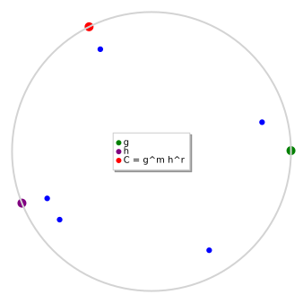

# Pedersen Commitments: Building the Sealed Envelope

*Chapter 11 — The Bedrock · the discrete-log commitment that closes the Ch 2 spiral*
*Target depth: rigorous · stratum: Group theory & number-theoretic hardness (where security lives)*

*Figure — the order-1019 subgroup of (ℤ/2039ℤ)\* drawn as a clock. Green `g = 9` and purple `h = 726` are the two public generators; red `C = g⁴²·h⁸⁰⁰ = 71` is the commitment; the blue points are the hiding orbit `{ Com(42, r) : r ∈ {0,1,800,17,999} } = {1641, 590, 71, 143, 834}` — the same message, smeared across the group by the randomness.*

> **Animation:** [`animations/pedersen-commitment.mp4`](animations/pedersen-commitment.mp4) — first **hiding**: with the message `m = 42` fixed, the randomness `r` is swept and the committed point walks all around the group (it is uniform over the whole ring); then **binding**: for a fixed `(m, r)` the commitment is the single point `C = 71`, and a second opening to a different message would reveal `log_g(h)` — the discrete log. The displayed values (`p = 2039`, `q = 1019`, `g = 9`, `h = 726`, `m = 42`, `r = 800`, `C = 71`) are the ones we compute below.

---

> ### Math you'll need
>
> - **A cyclic group and its generator.** A *group* is a set with one associative operation (here, multiplication mod `p`) that has an identity and inverses; it is *cyclic* when a single element `g` — a *generator* — produces every element as a power `g, g², g³, …`. Ours is the set of order-1019 powers inside `(ℤ/pℤ)*`.
> - **The group order.** The *order* of the group is how many elements it has; we write it `q`. When `q` is prime — as it is here, `q = 1019` — *every* non-identity element is a generator, which is why both `g` and `h` below are generators. (We pick a **safe prime** `p = 2q + 1 = 2039` precisely so this prime-order subgroup exists.)
> - **The discrete-logarithm (DLog) problem.** Given a generator `g` and an element `h = gᵃ`, finding the exponent `a` is the *discrete log* of `h` base `g`, written `log_g(h)`. The **DLog assumption** is the bet that in our group no efficient computation can recover `a`. This single bet is what binding rests on.
> - **Hiding.** A commitment *hides* if the committed value `C` reveals nothing about the message inside it — the same `C` could have come from any message.
> - **Binding.** A commitment *binds* if you cannot, after the fact, open `C` to a message different from the one you committed to.
>
> Two moduli are in play and keeping them straight is the whole game: group elements multiply **mod `p = 2039`**, while exponents are added and inverted **mod `q = 1019`**.
>
> *Carried in from Ch 2:* the **sealed envelope** — a commitment with hiding and binding, named there but deliberately **not built**. *Carried in from Ch 9–10:* hiding and binding given rigorous definitions, and the *knowledge extractor* met as the Schnorr/Sigma "two transcripts" move. Here we finally **build** the envelope.

---

## Pre-rigorous — one point on a clock, two promises

Back in Chapter 2 you met a sealed envelope: write a number on a slip, seal it, hand it over. Two promises came with it — the envelope **hides** the number until you open it, and once sealed you **can't swap** the slip. We never built the envelope; we only described it. Now we build it.

Look at the figure. A prime-order group is just a clock face, and we paint two public marks on the rim: `g` and `h`. To commit to a message `m`, you also roll a secret die `r`, and you place a **single point** on the clock. That point is your sealed envelope.

The picture shows the magic. Keep the message `m` fixed and just **re-roll `r`**: the blue point jumps all around the clock — over every possible roll it lands on every position equally often. So from the sealed point alone, an onlooker cannot tell which message you started from: the die has *smeared* it across the whole ring. That is **hiding**, and you can *see* it.

Now the other promise. For a fixed message and a fixed die, there is exactly **one** point. To later claim a *different* message, you'd have to find a second die that lands on the very same point — and the only way to do that is to know the secret relationship between the two marks `g` and `h`, which nobody does. That is **binding**.

One picture, both promises: a die that smears the message everywhere (hiding) yet pins down a single point per `(message, die)` pair (binding).

## Rigorous — earn the two properties

Work in a cyclic group of **prime order `q`** — concretely the order-`q = 1019` subgroup of `(ℤ/pℤ)*` for the safe prime `p = 2039`, so every non-identity element generates. Fix two generators `g` and `h`; crucially, `h = gᵃ` for some `a = log_g(h)` that **nobody knows**. The **Pedersen commitment** to a message `m ∈ ℤ/qℤ` with randomness `r ∈ ℤ/qℤ` is

> **`C = Com(m, r) = gᵐ · hʳ`** — the message goes into the exponent of the first generator, the secret die into the exponent of the second, and the two are multiplied in the group.

**Hiding is perfect — it holds with no assumption at all.** Fix any `m`. As `r` ranges over `ℤ/qℤ`, the term `hʳ` ranges over the *entire* group, so the map `r ↦ gᵐ · hʳ` is a **bijection** onto the group: `C` is uniformly distributed and statistically **independent of `m`**. Nothing about the message survives, so even an *unbounded* adversary with all the time in the universe learns nothing — that is what "perfect" (information-theoretic) means. Said the other way: for **any** target message `m′` there is exactly one `r′ = r + (m − m′)·a⁻¹ (mod q)` with `gᵐ′ · hʳ′ = C`, so `C` is consistent with *every* message at once.

**Binding is computational — it holds exactly as hard as discrete log.** Suppose an adversary outputs two valid openings `(m, r) ≠ (m′, r′)` of the same `C`. Then `gᵐ hʳ = gᵐ′ hʳ′`, so `g^{m−m′} = h^{r′−r}`, and taking the discrete log of both sides gives

> **`log_g(h) = a = (m − m′)·(r′ − r)⁻¹ (mod q)`**  (and `r′ ≠ r` whenever `m ≠ m′`, so the inverse exists).

Producing two openings is *exactly* solving the discrete log of `h` base `g`. Under the DLog assumption no efficient adversary can, so binding holds against *bounded* adversaries only — it is computational, not perfect.

That same pair of facts dismantles the tempting bad intuitions. Start with the one that matters most: `g` and `h` are not an arbitrary pair of marks. Their *unknown relative log* `a` **is** the binding security itself — anyone who knew `a` could open any `C` to any message at will, so the whole guarantee lives in the secrecy of that one number. Worry next about the message leaking from the exponent. It does not: the blinding factor `hʳ` smears `C` uniformly across the entire group, leaving `C` independent of `m`. Notice, too, that the two properties do not rest on the same foundation. Hiding is a *counting* fact and asks for no assumption at all; only binding leans on the hardness bet. And do not mistake "merely computational" for "weak" — to break binding is to have already solved discrete log, the very hardness bet this chapter stands on.

For our concrete group: `g = 9`, `h = 726`, `m = 42`, `r = 800` give `C = 71`. The alternate opening `m′ = 100` forces `r′ = 800 + (42−100)·571⁻¹ (mod 1019) = 186`, and `g¹⁰⁰ · h¹⁸⁶ = 71 = C` — the same point, a different message, which is perfect hiding made concrete. Feeding those two openings to the extractor returns `a = (42−100)·(186−800)⁻¹ (mod 1019) = 571 = log_g(h)` — binding collapsing onto discrete log made concrete.

> **Note (which property is unconditional).** Hiding is **perfect** — proved by counting, no assumption, safe against an unbounded adversary. Binding is **computational** — it reduces to discrete log. You cannot make *both* perfect for one group element: the very alternate opening that proves perfect hiding is what an all-powerful adversary would use to break binding.

## Post-rigorous — both halves at once

Rebuild the intuition on the rigor. The clock that "smears the message everywhere" **is** the bijection `r ↦ gᵐ · hʳ` onto the whole group — perfect hiding is just the statement that this map is a uniform shuffle, which needs no assumption. The "single point per `(m, r)`, and you can't fake a second die" **is** the extractor: a second opening hands you `log_g(h)`, which the DLog assumption says you cannot have. Our marks make both vivid at once — `g⁴²·h⁸⁰⁰ = 71` and `g¹⁰⁰·h¹⁸⁶ = 71` are the same point reached by two messages (hiding), and the extractor run on those two openings returns `log_g(h) = 571` (binding).

So the asymmetry is now **inevitable** rather than arbitrary: hiding is unconditional because it is a counting fact about a finite group, while binding is conditional because it is a hardness fact about that same group. One promise is free; the other is a bet — and a single sealed point cannot make both unbreakable, since the alternate opening that guarantees perfect hiding is precisely the lever an unbounded adversary would pull against binding. You could have invented all of this yourself: wanting a seal that reveals nothing yet cannot be reopened, and holding a group with a generator `g` and a second element `h` whose log you don't know, you would publish `C = gᵐ · hʳ` — hiding by counting, binding by the algebra of two openings — and you would have arrived at Pedersen.

This is the construction that finally builds Ch 2's sealed envelope — and it is the doorway to a whole line. Stack many generators and you get the **vector Pedersen commitment** `hʳ · ∏ᵢ gᵢ^{mᵢ}`, which seals an entire list of values in one group element; its succinct opening is the **inner-product argument**, the engine of **Bulletproofs**. Its additive homomorphism `Com(m₁,r₁)·Com(m₂,r₂) = Com(m₁+m₂, r₁+r₂)` lets you add sealed values without opening them, which is what powers range proofs and proof-of-reserves. Keep one boundary sharp as you cross into that territory: this is a **discrete-log, transparent, additively-homomorphic** commitment — perfectly hiding, computationally binding — and it is *not* a KZG / pairing commitment, which is computationally binding under q-SDH and needs a trusted setup. Both are built in this chapter, and the next step is to walk that vector form straight into Bulletproofs.

---

## Check yourself

**Recall.** Write down the Pedersen commitment to a message `m` with randomness `r` in a prime-order group with public generators `g` and `h`, and name its two security properties and which one is unconditional.
> *Answer:* `Com(m, r) = gᵐ · hʳ`. It is **perfectly (information-theoretically) hiding** and **computationally binding**. Hiding is the unconditional one — it needs no assumption; binding rests on the discrete-log assumption between `g` and `h`.
> *If you miss this →* revisit **the discrete-logarithm assumption** (given `g` and `h = gᵃ`, recovering `a` is infeasible).

**Apply.** In the order-1019 subgroup of `(ℤ/2039ℤ)*` with `g = 9`, `h = 726`, you publish `C = g⁴²·h⁸⁰⁰ = 71`. Does `C` leak the message `m = 42`? Exhibit a different message `m′ = 100` that the same `C` also opens to, and give the randomness `r′`.
> *Answer:* `C` does not leak `m`: for the fixed message, `r ↦ g⁴²·hʳ` is a bijection onto all 1019 group elements, so `C = 71` is uniform and independent of `m`. The same `C = 71` opens to `m′ = 100` with `r′ = r + (m − m′)·a⁻¹ (mod 1019)`, where `a = log_g(h) = 571`; this gives `r′ = 186`, and `g¹⁰⁰·h¹⁸⁶ ≡ 71 (mod 2039)`.
> *If you miss this →* revisit **modular arithmetic and modular inverses in `ℤ/pℤ` and `ℤ/qℤ`**.

**Transfer.** Suppose an adversary produces two valid openings `(m, r)` and `(m′, r′)` of the **same** commitment `C` with `m ≠ m′`. What have they necessarily computed, and what does this say about the assumption binding rests on — and why is hiding *not* in the same boat?
> *Answer:* From `gᵐhʳ = gᵐ′hʳ′` you get `g^{m−m′} = h^{r′−r}`, hence `log_g(h) = (m − m′)·(r′ − r)⁻¹ (mod q)`. Two openings force the discrete log of `h` base `g`: breaking binding == solving DLog, which is why binding is only computational. Hiding is different — proved by counting (`r ↦ Com(m,r)` is uniform), needs no assumption, and holds even against an unbounded adversary, so it is perfect.
> *If you miss this →* revisit **the discrete-logarithm assumption**.

**Rediscover.** You want to seal a number `m` so that the seal reveals nothing yet cannot be reopened to a different `m`. You have a prime-order group with generator `g` and may publish a second element `h` whose discrete log base `g` you do not know. Derive a commitment from scratch and argue both properties.
> *Answer:* Publish `C = gᵐ · hʳ` for fresh random `r`. **Hiding:** for fixed `m`, `hʳ` is uniform over the whole group, so `C` is uniform and independent of `m` (no assumption). **Binding:** two openings give `g^{m−m′} = h^{r′−r}`, so you'd know `log_g(h)`; nobody does. That is the Pedersen commitment.
> *If you miss this →* revisit **prime-order groups** (every non-identity element is a generator; safe primes `p = 2q + 1`).

---

*Next: walk the vector form `hʳ·∏ᵢ gᵢ^{mᵢ}` into the inner-product argument, where one short proof opens a commitment to an entire vector — the move that turns Pedersen into Bulletproofs.*
