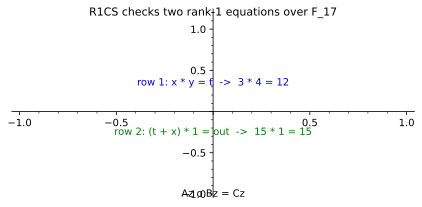

# R1CS: Every Row Asks for One Product

*Chapter 6/10 - from constraint tables to sealed certificates*
*Target depth: rigorous - stratum: linear algebra*

*Figure - The witness `z = [1, x=3, y=4, t=12, out=15]` satisfies two rank-1 constraints: `x * y = t` and `(t + x) * 1 = out`.*

> **Animation:** [`animations/r1cs.mp4`](animations/r1cs.mp4) - a witness vector is tested row by row until the Hadamard equation `Az o Bz = Cz` is satisfied.

---

> ### Math you'll need
> A vector is an ordered list of field elements. A linear combination just means you take the witness values, multiply each by a chosen number, and add the results — so `2x + 3y` is a linear combination of `x` and `y`; crucially no two unknowns are ever multiplied together here. A matrix times a vector forms one such linear combination per row from the vector entries. The symbol `o` in `Az o Bz` means coordinate-by-coordinate multiplication, also called the Hadamard product: multiply the first entries, then the second entries, and so on.

---

## Pre-rigorous - a circuit as receipts

A program can say "compute `x*y + x`," but a proof system wants receipts. It wants every hidden wire to be pinned down so the prover cannot skip the expensive step and only present the final answer.

R1CS, short for rank-1 constraint system, turns the computation into rows. Each row asks for one multiplication of two linear combinations. In the tiny example, the witness says `x = 3`, `y = 4`, `t = 12`, and `out = 15`. The first row checks that `t` really is `x*y`. The second row checks that `out` really is `t + x`.

You could have invented this from the need to police intermediate work. Addition is easy to fold into a linear combination. Multiplication is the expensive event, so each row isolates one product and records what it must equal.

## Rigorous - the Hadamard equation

Let `z` be the witness vector, including a leading `1` so constants can appear in linear combinations. An R1CS instance is three matrices `A`, `B`, and `C` over a field. The witness satisfies the instance when

> `Az o Bz = Cz`.

Here `Az` is the vector of left linear combinations, `Bz` is the vector of right linear combinations, and `Cz` is the vector of target linear combinations. The equality is coordinate-wise: for every row `i`, `(A_i z) * (B_i z) = C_i z`.

For the figure, `z = [1,3,4,12,15]`, where the entries are `[1,x,y,t,out]` over `F_17`. Row 1 selects `x` on the left, `y` on the right, and `t` on the target, so it checks `3 * 4 = 12`. Row 2 selects `t + x` on the left, `1` on the right, and `out` on the target, so it checks `15 * 1 = 15`. The computed vectors are `Az = [3,15]`, `Bz = [4,1]`, and `Cz = [12,15]`; their coordinate products are `[12,15]`, so the witness satisfies the system.

The bad intuition is that R1CS is the program. It is not. It is a relation: a set of equations a witness must satisfy. If the compiler forgets a constraint, the relation may accept a witness that no honest program run would produce. That is the deep version of under-constraint Ch 6 keeps warning about.

## Post-rigorous - why this shape persists

R1CS matters because it is simple enough to compile and algebraic enough to seal. Chapter 6 uses it as the first dialect of arithmetization: computation becomes field equations. Chapter 10 revisits it through the QAP route, where many row checks are compressed into a single polynomial divisibility check that Groth16 can commit to succinctly.

The row shape also explains why later systems generalize it. AIR arranges constraints over time; PLONKish systems add custom gates and copy constraints; CCS abstracts several dialects at once. But the old R1CS slogan remains a useful anchor: every row asks for one product, and the witness must make all rows true.

## Check yourself

**Recall.** What does `Az o Bz = Cz` mean?
> *Answer:* It means each coordinate of `Az` multiplied by the matching coordinate of `Bz` equals the matching coordinate of `Cz`.
> *If you miss this ->* revisit Hadamard product as coordinate-by-coordinate multiplication.

**Apply.** With `z = [1,3,4,12,15]`, why does row 1 pass for `x*y=t`?
> *Answer:* The row selects `x = 3`, `y = 4`, and `t = 12`, and `3 * 4 = 12` in `F_17`.
> *If you miss this ->* revisit how matrix rows select linear combinations of witness entries.

**Transfer.** Why is the leading `1` included in the witness vector?
> *Answer:* It lets matrix rows include constants as linear combinations, since selecting the first coordinate contributes a fixed `1`.
> *If you miss this ->* revisit linear combinations and constant terms.

**Rediscover.** You need to encode a computation for a proof system that is comfortable with linear algebra and multiplication. What row shape would you choose?
> *Answer:* Put additions into linear combinations and require one product per row: left linear combination times right linear combination equals a target linear combination. That is the R1CS shape.
> *If you miss this ->* revisit why multiplication is the nonlinear event a constraint must isolate.

---

*Next, this row-by-row relation can be compressed into polynomial checks, which is why R1CS becomes one of the main roads into Groth16 and the sealed certificate.*
