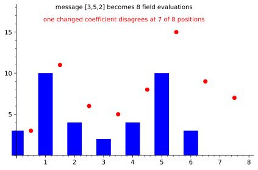

# Reed-Solomon Encoding: A Message Spread into Many Checks

*Chapter 7 - polynomial fingerprints and the road to FRI*
*Target depth: rigorous - stratum: Algebra I*

*Figure - The message `[3,5,2]` is treated as the polynomial `3 + 5x + 2x^2` and evaluated at eight field points. Changing one coefficient gives another low-degree polynomial that disagrees at 7 of those 8 positions.*

> **Animation:** [`animations/reed-solomon.mp4`](animations/reed-solomon.mp4) - a short coefficient list expands into eight evaluations, then a nearby message is shown disagreeing almost everywhere.

---

> ### Math you'll need
> `F_17` means ordinary arithmetic with every result wrapped back into `0..16` by taking the remainder on division by 17 (so 21 becomes 4, and 136 becomes 0); 17 is prime, so division works and you never leave that range. A codeword is the longer string sent by an error-correcting code. In a Reed-Solomon code, the message is first read as coefficients of a low-degree polynomial, and the codeword is the list of that polynomial's values on a chosen evaluation domain. The distance between two codewords is the number of positions where they differ.

---

## Pre-rigorous - not copies, shadows

If you protect a message by copying it eight times, a liar knows exactly how to forge one position: change just that copy. Reed-Solomon does something less obvious. It turns the message into a polynomial and sends many shadows of that polynomial.

For the message `[3,5,2]`, read the entries as coefficients of `p(x) = 3 + 5x + 2x^2` over `F_17`. Evaluate `p` at `0,1,...,7`. The resulting codeword is `[3,10,4,2,4,10,3,0]`. None of those eight values is a simple copy of the message, but together they are locked by the same degree-2 polynomial.

You could have invented this from the problem. A verifier wants many places to sample, but those places must be tied together so a cheater cannot edit them independently. Low degree is the tie.

## Rigorous - distance from low degree

A Reed-Solomon code of dimension `k` chooses messages with `k` field elements and treats them as coefficients of a polynomial of degree less than `k`. It then evaluates that polynomial on `n` distinct field points. The result is an `n`-symbol codeword.

The protection comes from the root-count fact. If two messages are different, their polynomials `p` and `q` are different and both have degree less than `k`. The difference `D = p - q` is a nonzero polynomial of degree at most `k - 1`. Agreement positions are exactly roots of `D`, so there can be at most `k - 1` of them. Therefore the two codewords differ in at least `n - (k - 1)` positions.

For the figure, `n = 8` and `k = 3`, so the designed minimum distance is `8 - 3 + 1 = 6`. The altered message `[3,6,2]` differs by the polynomial `x`, so the two codewords agree only at `x = 0` and differ in 7 positions. The guarantee says at least 6; this pair happens to do better.

This dismantles a common mistake. The extra symbols are not extra copies. They are evaluations that must all fit one low-degree shape. A forged codeword can change a few positions, but unless it stays close to a low-degree polynomial, random checks will see the damage.

## Post-rigorous - why proof systems care

Reed-Solomon is the coding-theory face of the same idea Ch 7 keeps using: global low-degree structure creates local fingerprints. If two low-degree messages are different, they cannot agree at many evaluation points. If a claimed evaluation table is far from every low-degree polynomial, low-degree testing can catch that too.

That is why the graph points forward to FRI and STARKs. FRI is, at heart, a way to convince a verifier that a long evaluation table is close to a Reed-Solomon codeword without reading the whole table. Polynomial commitments later add binding, but the distance story begins here.

## Check yourself

**Recall.** In Reed-Solomon encoding, what is sent as the codeword?
> *Answer:* The values of the message polynomial on a chosen set of distinct field points.
> *If you miss this ->* revisit the coefficient view of a message polynomial.

**Apply.** For `p(x) = 3 + 5x + 2x^2` over `F_17`, what is `p(2)`?
> *Answer:* `3 + 10 + 8 = 21`, which is `4` modulo 17.
> *If you miss this ->* revisit evaluation in a finite field.

**Transfer.** Why do two different dimension-`k` Reed-Solomon messages differ in many positions?
> *Answer:* Their difference is a nonzero polynomial of degree at most `k - 1`, so it has at most `k - 1` roots. They can agree only at those roots, and must differ everywhere else in the evaluation domain.
> *If you miss this ->* revisit the root-count fact for nonzero polynomials.

**Rediscover.** You want a long fingerprint of a short message, with the rule that different messages cannot look alike in many places. What construction would you try after learning interpolation?
> *Answer:* Treat the message as a low-degree polynomial and evaluate it at many points. Low degree prevents two different messages from agreeing on too many evaluations.
> *If you miss this ->* revisit Lagrange interpolation and uniqueness under a degree bound.

---

*Next, Lagrange interpolation runs this construction in reverse: given the evaluations on a domain, it rebuilds the one low-degree polynomial they came from, turning a codeword back into its message and setting up the multilinear extensions and Schwartz-Zippel tests that follow.*
