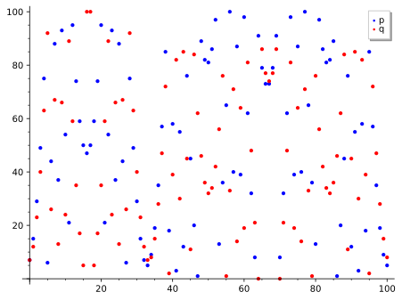

# Schwartz–Zippel: Why Polynomials Catch Liars

*Chapter 7 — Fingerprints · the probabilistic-checking primitive beneath Layer 4*
*Target depth: rigorous · stratum: Algebra I (fields & univariate polynomials)*

*Figure — `p(x)=3x²+5x+7` (blue) and `q(x)=3x²+2x+7` (red) evaluated at all 101 points of the field `F_101`. They coincide at exactly one point, `x = 0`.*

> **Animation:** [`animations/schwartz_zippel.mp4`](animations/schwartz_zippel.mp4) — points of `p` (blue) and `q` (red) are dropped one at a time; the single green flash at `x = 0` is their only meeting. The `2/101` on screen is the *worst* a degree-2 pair could do; this pair does better.

---

> ### Math you'll need
>
> - **A finite field** is a number system with finitely many elements where you can add, subtract, multiply, and divide. Ours, `F_101`, is just the numbers `0, 1, …, 100` with arithmetic taken "mod 101" (wrap around after 100). Write `|F|` for how many elements it has — here `|F| = 101`.
> - **A *root* of a polynomial** is an input where the polynomial evaluates to zero.
> - **The root-count fact** (the *factor theorem*): a nonzero polynomial of degree `d` over a field has **at most `d` roots** — each root `r` lets you peel off a factor `(x − r)`, and a degree-`d` polynomial has room for only `d` such factors.
>
> *Carried in from Ch 6:* the spreadsheet/arithmetization picture, where Schwartz–Zippel first appeared as a slogan — *"checking one random cell catches a forged table."* Here we earn it.

---

## Pre-rigorous — one random poke

Picture a forger who hands you a giant filled-out spreadsheet and swears every cell obeys the rules. Re-checking the whole sheet is hopeless. So you do something almost insolent: you point at **one random cell** and check only that.

Here is why that works. Encode each side of a claim as a polynomial; two honest sides give the *same* polynomial, a forged side gives a *different* one. Two different low-degree polynomials are like two gently curving graphs — they can cross only a handful of times. Over `F_101` our blue `p` and red `q` meet at exactly one of the 101 points. So a finger dropped at random lands where they disagree on 100 tries out of 101, and the lie is exposed. You never had to read the whole sheet.

## Rigorous — earn the bound

Let `F` be a finite field with `|F|` elements, and let `p, q` be polynomials over `F` of degree at most `d`, with `p ≠ q`.

Form the difference `D = p − q`. Since `p ≠ q`, the polynomial `D` is nonzero and of degree at most `d`, so by the root-count fact it has at most `d` roots. A point where `p` and `q` agree is exactly a point where `D` is zero — a root of `D`. So `p` and `q` agree at no more than `d` of the `|F|` points.

Now pick the test point `r` so that every one of the `|F|` points is equally likely — this is what *uniformly at random* means. The chance the test fails to notice that `p ≠ q` is then

> `Pr[p(r) = q(r)] = Pr[D(r) = 0] = (number of roots of D) / |F| ≤ d / |F|.`

That one inequality dismantles the tempting wrong ideas. Passing a single check does *not* prove `p = q`; it only bounds the chance of a missed difference by `d/|F|`. Two different degree-`d` polynomials cannot agree arbitrarily often — they agree at most `deg(D) ≤ d` times. And the randomness lives only in the test point `r`: the polynomials `p` and `q` are fixed, even adversarial, and we never assume they are random.

For our pair, `D = p − q = 3x`. Its degree is 1, not 2, so it has at most one root, realized at `x = 0`. This pair's actual error is `1/101`; the worst a degree-2 pair could do is `2/101`. Both numbers are real and they are not the same: `2/101` is the guarantee for *any* distinct degree-2 pair, while `1/101` is what *this* pair achieves because its difference happened to drop to degree 1.

## Post-rigorous — both halves at once

Now the slogan and the symbols are one statement. "Checking one random cell catches a forged spreadsheet" *is* the inequality `Pr ≤ d/|F|`, with the spreadsheet's algebraic identity playing the role of `D`; and the picture of two curves crossing only a few times *is* the root-count fact, a nonzero `D` of degree `≤ d` having `≤ d` roots and hence `≤ d` agreements.

That hands you the one knob that controls reliability. The bad points number at most `d` no matter what; only the denominator `|F|` is yours to move. Grow the field and `d/|F|` shrinks — the test sharpens for free. (The slogan "almost always catches the lie" is precise only once the field is much larger than the degree; over a tiny field the bound is weak.) This is the primitive beneath Layer 4: a claim about a whole constraint table — the constraint systems we meet later — collapses to one random evaluation, and sum-check and polynomial commitments are built on the very same move.

Two boundaries keep this honest. First, the bound is **unconditional** — pure root-counting, not a cryptographic hardness assumption; the security models of Ch 11–12 need the other kind, and conflating the two breaks those arguments. Second, we proved the **one-variable** case; the lemma generalizes to many variables with total degree `d` and the same `d/|F|` bound — the proof there is an induction resting on the union bound — and that multivariate form is what sum-check actually invokes.

You could have invented this. Knowing only that a degree-`d` polynomial has at most `d` roots, you would test whether two polynomials are equal by subtracting them and poking the difference at a random point — and you would have landed on Schwartz–Zippel.

---

## Check yourself

**Recall.** If `p` is a nonzero polynomial of degree `d` over a finite field `F`, what is the probability that `p(r) = 0` for a uniformly random `r ∈ F`, and why?
> *Answer:* At most `d/|F|`. A nonzero degree-`d` polynomial has at most `d` roots (the factor / root-count fact), and `r` is one of `|F|` equally likely points, so the chance of hitting a root is `(number of roots)/|F| ≤ d/|F|`.
> *If you miss this →* revisit the root-count fact (a nonzero degree-`d` polynomial has `≤ d` roots).

**Apply.** Let `p(x) = 3x² + 5x + 7` and `q(x) = 3x² + 2x + 7` over `F_101`. At how many points do they agree, which one(s), and what is the chance a single random evaluation fails to tell them apart?
> *Answer:* They agree where `p − q = 3x = 0`, i.e. only at `x = 0` — one agreement point. A single random `r` fails to distinguish them with probability `1/101 ≈ 0.99%` (never more than the degree-2 worst case `2/101 ≈ 1.98%`).
> *If you miss this →* revisit polynomials over a finite field (degree, roots, evaluation).

**Transfer.** A prover claims a giant computation's whole constraint table is satisfied. Why does checking one random field point catch a cheater with high probability, and what drives the error toward zero?
> *Answer:* The table identity is encoded as a polynomial identity `P = 0`; a cheater's `P` is nonzero of low degree, so it is nonzero at all but `≤ d` of the `|F|` points, and a random challenge exposes the cheat with probability `≥ 1 − d/|F|`. The error shrinks as you enlarge `|F|` (the `≤ d` bad points stay fixed while the denominator grows) or lower the encoding degree `d`.
> *If you miss this →* revisit the `≤ d` root-count fact (and, for many variables, the union bound).

**Rediscover.** Knowing only that a nonzero degree-`d` polynomial has at most `d` roots, derive a cheap test that two polynomials `p, q` are equal, and give its failure probability.
> *Answer:* Form `D = p − q`. If `p = q` then `D ≡ 0`; if `p ≠ q` then `D` is nonzero of degree `≤ d`, with `≤ d` roots. Pick `r` uniformly in `F` and test `D(r) = 0`: if `D(r) ≠ 0` you are certain `p ≠ q`; if `D(r) = 0` you accept `p = q`, wrong only when `r` is one of the `≤ d` roots — probability `≤ d/|F|`. That is Schwartz–Zippel.
> *If you miss this →* revisit finite fields and `F_p` arithmetic.

---

*Next: the same one-random-point idea, lifted from one variable to many, becomes sum-check — the move that lets a verifier check an exponentially large sum in a handful of rounds.*
