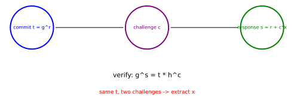

# Sigma Protocols: How a Secret Answers a Random Question

*Chapter 9 - IOPs, commitments, and knowledge soundness*
*Target depth: rigorous - stratum: group protocols*

*Figure - A Schnorr-style Sigma protocol has the shape `commit -> challenge -> response`. The verifier accepts when `g^s = t * h^c`.*

> **Animation:** [`animations/sigma-protocols.mp4`](animations/sigma-protocols.mp4) - the transcript is built in order, then the verification equation balances; a second challenge with the same first message exposes the witness.

---

> ### Math you'll need
> A **group** is a set where elements can be combined, where there is an identity element, and where every element has an inverse. A **subgroup** is a smaller self-contained group living inside a larger one. In a **prime-order cyclic group**, one generator `g` reaches every element by repeated multiplication, and the number of elements — the **order** — is a prime `q`. Here that group is the order-`q` subgroup of the nonzero remainders modulo a prime `p`, so the example carries two moduli: a **group element** is a number reduced mod `p`, while an **exponent** counts how many times you multiply and is reduced mod `q`. The notation `g^x` means multiply `g` by itself `x` times inside the group, reducing the product mod `p` at each step. A **commitment** fixes a value before a later opening; here the first protocol message `t` fixes randomness before the verifier's challenge arrives.

---

## Pre-rigorous - answer after the question

The protocol is a short conversation with a strict order. The prover first sends a value that looks random. Only after that does the verifier choose a challenge. The prover then answers in a way that makes one group equation balance.

The order is the point. If the prover could wait to see the challenge before choosing the first message, the conversation would be easy to fake. By committing first, the prover is pinned to a line; the later challenge asks for a point on that line. Someone who truly knows the secret can answer any challenge. Someone who is faking can usually prepare for only one.

You could have invented this shape from a simple demand: make the prover do something irreversible before the verifier asks the question.

## Rigorous - Schnorr as the model case

Work in the prime-order-`q` subgroup of `(ℤ/pℤ)*`, the nonzero remainders modulo a prime `p`, with `p = 2039` and `q = 1019` (`q` divides `p − 1`, since `2039 = 2·1019 + 1`). The group `g` generates is this subgroup. Two moduli are in play, and keeping them apart is the whole game: a **group element** — `g`, `h`, the commitment `t`, and either side of the verification equation — is a remainder mod `p = 2039`, while an **exponent** or **challenge** — `x`, `r`, `s`, `c` — is reduced mod `q = 1019`. The prover knows a secret exponent `x`, and the public value is `h = g^x`. A Schnorr Sigma protocol proves knowledge of `x` without sending `x`.

The prover samples fresh randomness `r` and sends the commitment

> `t = g^r mod p`.

The verifier sends a random challenge `c`. The prover responds with

> `s = r + c*x mod q`,

where "mod `q`" means this exponent arithmetic wraps around at the order `q` — it is bookkeeping on the exponents, not on the group elements. The verifier checks, working with group elements mod `p`,

> `g^s = t * h^c mod p`.

The equation holds because `g^s = g^(r+c*x) = g^r * (g^x)^c = t * h^c`. In the toy transcript, `p = 2039`, `q = 1019`, `g = 9`, `x = 321`, `r = 412`, `c = 77`, `t = 1077`, and `s = 673`. Notice that `t = 1077` exceeds the order `q = 1019`: that is expected, because `t` is a group element reduced mod `p = 2039`, not an exponent. Following the arithmetic, `g^412 mod 2039 = 1077`, and the verifier computes both sides as `g^673 mod 2039 = 1818` and `t * h^77 mod 2039 = 1818`, so the transcript accepts.

Special soundness is the extraction property. Suppose an extractor sees two accepting transcripts with the same `t` but different challenges `c` and `c'`. The responses satisfy `s = r + c*x` and `s' = r + c'*x`. Subtracting cancels the hidden `r`, leaving `s - s' = (c - c')x mod q`, so

> `x = (s - s') / (c - c') mod q`.

Division modulo `q` means multiplying by the inverse of `c - c'`, which exists because `q` is prime and the challenges differ. In the example, the second challenge is `203`, the second response is `359`, and the extraction formula returns `x = 321`.

This destroys a common confusion. One accepting transcript convinces the verifier that the answer fits the challenge; it does not by itself hand over the witness. Extraction appears when the same first message survives two different challenges.

## Post-rigorous - why the template matters

The Sigma shape is the small version of a knowledge-sound proof. The first message fixes the prover's degrees of freedom. The random challenge cuts across that commitment. The response can satisfy the verifier only if the prover had the hidden structure, or else if a rewind can force two challenges and extract that structure.

Zero-knowledge is a different property: it asks whether the transcript leaks the witness. Special soundness asks whether two accepting transcripts reveal it. A good protocol can have both properties, but they answer opposite questions, and merging them makes the later extractor arguments unreadable.

## Check yourself

**Recall.** What are the three messages in a Schnorr Sigma protocol?
> *Answer:* The prover sends t = g^r, the verifier sends a random challenge c, and the prover responds with s = r + c*x mod q.
> *If you miss this ->* revisit commit-challenge-response order.

**Apply.** Using the worked values, what equation verifies the transcript?
> *Answer:* It checks g^s = t*h^c; both sides equal 1818 in the toy group.
> *If you miss this ->* revisit group exponent laws.

**Transfer.** Why does reusing the same t under two challenges reveal x?
> *Answer:* The two equations share r, so subtracting responses cancels r and leaves (c-c')x; division by c-c' modulo q extracts x.
> *If you miss this ->* revisit modular inverses and linear equations.

**Rediscover.** Design a protocol where a secret exponent answers a random challenge without being sent. What should the response be?
> *Answer:* Send a random-looking t = g^r first, then answer c with s = r + c*x; verification works because g^s = g^r(g^x)^c.
> *If you miss this ->* revisit Schnorr transcript algebra.

---

*Next: the same extractor logic is lifted from this compact transcript into the proof-system families that seal full computations.*
