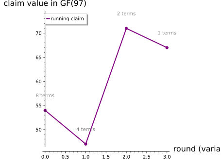

# Sum-Check: Convincing a Verifier of a Sum Nobody Adds Up

*Chapter 8 — The One Idea: Sum-Check and GKR · the engine beneath Layer 4*
*Target depth: rigorous · stratum: Algebra II (multivariate & multilinear)*

*Figure — the sum-check ladder. The verifier never adds the eight corners of `{0,1}³`. The running claim it is asked to trust starts at `H = 54`, then narrows to `g₁(r₁)=47`, `g₂(r₂)=71`, and finally `g₃(r₃)=67` — eight terms folded into four, then two, then one single evaluation `g(2,3,4)=67`, all in `GF(97)`.*

> **Animation:** [`animations/sum_check.mp4`](animations/sum_check.mp4) — the round-by-round reduction. Each round the prover sends a univariate `gᵢ(X)`; the verifier checks `gᵢ(0)+gᵢ(1)` equals the running claim (✓), then fixes a challenge `rᵢ` and the cube of remaining terms halves (8 → 4 → 2 → 1). It ends at the single evaluation `g(2,3,4)=67`, with the soundness bound `d·v/|F| = 2·3/97 = 6/97` on screen.

---

## Pre-rigorous — narrow the confession

The sum over the Boolean hypercube `Σ_{x∈{0,1}ᵛ} g(x)` adds the value of the polynomial `g` at all `2ᵛ` corners of the cube `{0,1}ᵛ`, a total that is astronomically large for real problems — that size is the whole difficulty. The protocol's central move is a univariate restriction: in round `i` it freezes the earlier variables to the challenges already chosen, leaves `xᵢ = X` free, and sums over the later 0/1 variables, collapsing the giant sum to a one-variable slice `gᵢ(X)`. Those rounds are a conversation between a prover, who knows `g`, and a verifier, who cannot afford to add `2ᵛ` terms and instead answers each message with a uniformly random challenge `rᵢ` drawn from the finite field `F` — for us `GF(97)`, arithmetic mod 97, so `|F| = 97`. Soundness rests on one fact carried from Ch 7: a nonzero polynomial of degree `d` has at most `d` roots, so it is zero at a random point with probability at most `d/|F|`.

Picture a prosecutor facing a suspect who swears to an alibi covering an impossible number of moments at once — every minute of a whole week. She cannot replay the week. So she **narrows**: "Account for Monday." The suspect gives a consistent sub-story; she picks a **random hour** inside it, pins it down, and demands he account for *that* — then a random minute inside *that*. A truthful suspect's story survives every narrowing. A liar's must eventually contradict itself at a moment he could not have anticipated.

Sum-check is exactly this move. A prover claims a single number `H` is the total of a polynomial `g` over all `2³ = 8` corners of the cube `{0,1}³` — and for real problems there are far too many corners to add. The figure shows the trick: the verifier never adds them. Each round the prover hands over a small **one-variable story** `gᵢ`, the verifier checks that it splits consistently into its two halves, then drops a **random finger** `rᵢ` and demands the smaller story. After three narrowings nothing is left to add — just one point to check.

*(No formal notation yet beyond naming `g` and `H` — the "why" comes before the symbols.)*

## Rigorous — earn the protocol

Let `g` be a polynomial in `v` variables over a finite field `F`, with per-variable degree at most `d`, and let

> **`H = Σ_{x ∈ {0,1}ᵛ} g(x)`**

be the claimed sum.

**Round `i`.** The prover sends the univariate

> **`gᵢ(X) = Σ` over the remaining Boolean variables of `g`, with `x₁..x_{i−1}` fixed to the past challenges `r₁..r_{i−1}` and `xᵢ = X`.**

**Completeness.** An honest prover's `gᵢ` satisfies

> **`gᵢ(0) + gᵢ(1) = (running claim)`**

— because splitting variable `i` into its two Boolean values `0` and `1` is *exactly* the next step of the sum. Round 1 checks against `H`; round `i > 1` checks against `g_{i−1}(r_{i−1})`. The verifier checks that one identity, draws `rᵢ` **uniformly at random**, and recurses on the `(v−1)`-variable claim `gᵢ(rᵢ)`. After `v` rounds it checks the lone value `g_v(r_v) = g(r₁,…,r_v)` against `g` directly.

**Soundness (induction on rounds + Schwartz–Zippel).** If the prover lies, its `gᵢ` differs from the true round polynomial. The difference is a **nonzero** polynomial of degree `≤ d`, and by the Schwartz–Zippel root-count fact a nonzero degree-`≤d` polynomial vanishes at only `≤ d` of the `|F|` points — so a uniformly random `rᵢ` makes the two univariates disagree, exposing the lie, with probability `≥ 1 − d/|F|`. To keep cheating, the prover must at each round send a wrong `gᵢ` that *still* passes the consistency check, which forces it into a fresh false claim it again cannot honestly defend. A lie must survive **every** round. By the union bound, the total chance a liar slips through all `v` rounds is

> **`≤ d·v/|F|`.**

That one bound dismantles the tempting wrong ideas. Verifying a sum is *not* recomputing it: the verifier checks `v` consistency identities plus one final evaluation, never the `2ᵛ` terms. Nor does the verifier ever know the true partial sums — it only compares `gᵢ(0)+gᵢ(1)` to the *previous* reduced claim, and its sole contact with the real `g` is the single point `g(r₁,…,r_v)`. A caught liar cannot quietly repair the lie next round either, because each round's check is consistency against the last reduced claim, so a single lie must survive *all* the rounds; and the per-round risks **add** to `d·v/|F|`, they do not compound into a larger product. Finally, none of this needs a commitment: the only soundness ingredient is Schwartz–Zippel together with oracle access to `g`, so the bound is **unconditional** — no group, no commitment, no hardness assumption.

For our concrete instance, `g(x₁,x₂,x₃) = 2x₁²x₂ + 3x₂x₃ + x₁ + 5` over `GF(97)`, so `d = 2` (because `x₁` is squared) and `v = 3`. The worst-case bound is `2·3/97 = 6/97 ≈ 6.2%`.

> **Note (worst case vs realized).** `d` in `d·v/|F|` is the per-variable *degree bound* — the largest a round's univariate could be — which is `2` here because `x₁` appears squared. The realized round degrees are `2, 1, 1`, so the realized risk for *this* instance is `≤ (2+1+1)/97 = 4/97`, smaller than the worst-case `6/97`. They are different numbers and neither is a typo of the other.

## Post-rigorous — both halves at once

Rebuild the intuition on the rigor, both halves at once. The prosecutor's "narrow the confession until one checkable fact remains" **is** the round reduction that turns the `v`-variable claim `H = Σ_{x∈{0,1}ᵛ} g(x)` into the smaller claim `gᵢ(rᵢ)` and, after `v` narrowings, into the single evaluation `g(r₁,…,r_v)`. "The lie must contradict itself at a random moment he can't anticipate" **is** Schwartz–Zippel: a lying `gᵢ` differs from the true round polynomial by a nonzero degree-`≤d` polynomial, which a uniformly random `rᵢ` exposes with probability `≥ 1 − d/|F|`. "A truthful story survives every narrowing" **is** completeness — `gᵢ(0)+gᵢ(1)` equals the running claim, because splitting `xᵢ` into its two Boolean values is exactly the next term of the sum. And "being caught once is enough; luck doesn't compound into safety" **is** the induction on rounds, where the per-round risks `≤ d/|F|` *add* by the union bound to `≤ d·v/|F|` rather than multiplying into something larger.

Our concrete instance shows the narrowing as a chain of running claims, each the value handed to the next round — eight corners checked through three small univariate checks and one final evaluation, never the cube itself:

| Round | Prover sends `gᵢ(X)` | Split check `gᵢ(0)+gᵢ(1)` | Challenge `rᵢ` | New claim `gᵢ(rᵢ)` |
|---|---|---|---|---|
| start | — | — | — | `H = 54` |
| 1 | `23 + 4X + 4X²` | `23 + 31 = 54` ✓ | `r₁ = 2` | `g₁(2) = 47` |
| 2 | `14 + 19X` | `14 + 33 = 47` ✓ | `r₂ = 3` | `g₂(3) = 71` |
| 3 | `31 + 9X` | `31 + 40 = 71` ✓ | `r₃ = 4` | `g₃(4) = 67` |
| end | check against `g` directly | — | — | `g(2,3,4) = 67` ✓ |

Now the structure feels inevitable: the verifier does `v` small univariate checks plus one evaluation — an **exponential sum verified in work linear in `v`** — and the soundness knob is the *same* `d·v/|F|` Schwartz–Zippel dial from Ch 7, only summed over rounds.

Keep two boundaries sharp:

- **Sum-check is a *pure* reduction.** It assumes oracle access to `g` and uses **no** commitment, group, or hardness assumption. That purity is exactly why **GKR** is the first no-commitment proof system the reader meets, and why a commitment scheme only enters later (Ch 9) — when `g` itself must be pinned down.
- **Sum-check is *not* zero-knowledge by itself.** It reveals genuine evaluations of `g`; masking polynomials (Ch 9–10) are what make it ZK. Conflating the two corrupts the later security models.

You could have invented this. Knowing only that a low-degree univariate is pinned down by a few evaluations (so `gᵢ(0)+gᵢ(1)` should equal the running claim) and that a nonzero low-degree polynomial is nonzero at a random point with high probability, you would strip off one variable per round, check the split identity, pin a random `rᵢ`, recurse on the smaller claim, and finish with one direct evaluation — and you would have landed on sum-check, no commitment required.

This single gadget is the engine beneath Layer 4 and the most-reused move in the rest of the book. The same `g(r₁,…,r_v)` reduction reappears as grand-product / ZeroTest (Ch 9), as the hinge of Spartan (Ch 10), as the operation that *defines* folding schemes (Ch 14), and as LogUp-GKR driving zkVM lookups (Ch 15) — and because sum-check carries no commitment, it is the clean half of the SNARK recipe, waiting only for a polynomial commitment (Ch 9) to pin down `g` and complete the engine. Where Schwartz–Zippel let a verifier check one identity at a random point, sum-check lets it check an exponential *sum* in a handful of rounds; next, GKR chains this move up a whole circuit, layer by layer, so an entire computation collapses to a single trusted evaluation.

---

## Check yourself

**Recall.** In one round of sum-check, what does the prover send, and exactly which identity does the verifier check before moving on — and does the verifier ever recompute the true partial sum?
> *Answer:* The prover sends a univariate `gᵢ(X)` (the claimed partial sum with earlier variables fixed to past challenges and later variables summed over `{0,1}`). The verifier checks `gᵢ(0) + gᵢ(1) = ` running claim (`H` in round 1, `g_{i−1}(r_{i−1})` afterward). It never recomputes a true partial sum; its only direct contact with `g` is the final `g(r₁,…,r_v)`.
> *If you miss this →* revisit **the MLE (multilinear extension) — the object summed over the hypercube**.

**Apply.** For `g(x₁,x₂,x₃) = 2x₁²x₂ + 3x₂x₃ + x₁ + 5` over `GF(97)` with `H = 54` and fixed challenges `r₁=2, r₂=3, r₃=4`: the prover sends `g₁(X) = 23 + 4X + 4X²`. Check round 1, then state the running claim entering round 2 and the final value checked against `g` directly.
> *Answer:* Round 1: `g₁(0)+g₁(1) = 23 + 31 = 54 = H` ✓. Running claim entering round 2 = `g₁(2) = 47`. Then `g₂(X)=14+19X` gives `14+33=47=g₁(2)`, `g₂(3)=71`; `g₃(X)=31+9X` gives `31+40=71=g₂(3)`, `g₃(4)=67`. The one direct check against `g` is `g₃(4)=67 = g(2,3,4)=67`.
> *If you miss this →* revisit **summation over a finite domain — the sum over `{0,1}ᵛ`**.

**Transfer.** Why can a cheating prover not just repair its lie each round, and why is the total soundness error only `d·v/|F|` rather than something that blows up with the number of variables?
> *Answer:* A lie forces `gᵢ` to differ from the true round polynomial by a nonzero degree-`≤d` polynomial, so a random `rᵢ` exposes it with probability `≥ 1 − d/|F|` (Schwartz–Zippel), pushing the prover into a fresh undefendable claim; the lie must survive *every* round (induction). The per-round risks `≤ d/|F|` **add** by the union bound over `v` variables to `≤ d·v/|F|` — linear in `v`, tiny for a large field. No commitment or assumption is used.
> *If you miss this →* revisit **the Schwartz–Zippel lemma — the per-round soundness source**.

**Rediscover.** Knowing only that a low-degree univariate is pinned down by a few evaluations and that a nonzero low-degree polynomial is nonzero at a random point with high probability, design a protocol that convinces a verifier of `Σ_{x∈{0,1}ᵛ} g(x) = H` without adding `2ᵛ` terms, and give its error.
> *Answer:* Strip one variable per round; ask for `gᵢ(X)`, check `gᵢ(0)+gᵢ(1) = ` current claim, pick random `rᵢ`, recurse on `gᵢ(rᵢ)`; after `v` rounds check `g_v(r_v) = g(r₁,…,r_v)` directly. Honest provers always pass; a cheat survives with probability `≤ d·v/|F|`. That is sum-check — no commitment, just Schwartz–Zippel per round.
> *If you miss this →* revisit **proof by mathematical induction — the soundness argument is an induction on rounds**.

---

*Next: stack this one move up the layers of a circuit and you get GKR — sum-check applied to each layer in turn, so a whole computation reduces to a single trusted evaluation; bolt a polynomial commitment onto that final evaluation and you have the full SNARK recipe the rest of the book builds.*
